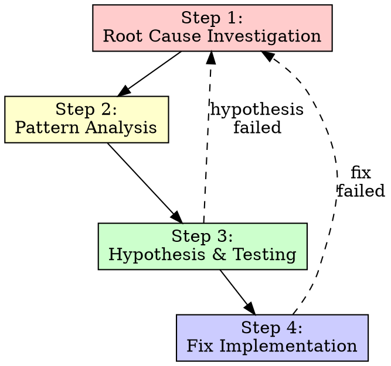

# recursive-debugging (Phase 1.5)

## Overview

When a requirement involves fixing a bug or investigating unexpected behavior, ad-hoc fixes waste time and create new bugs. Systematic debugging finds the root cause before any fix is attempted.

**Core Principle:** ALWAYS find root cause before attempting fixes. Symptom fixes are failure.

**The Iron Law for recursive-mode debugging:**
```
NO FIXES WITHOUT ROOT CAUSE INVESTIGATION FIRST
```

## Trigger examples

- `Tests are failing after the last change; debug it`
- `Fix crash on empty input`
- `Investigate why the API returns wrong data`
- `Do a root cause analysis before making changes`

## When to Use

**Mandatory Phase 1.5 when:**
- Requirement is a bug fix
- Test failures need investigation
- Unexpected behavior reported
- Performance problems
- Integration issues

**Use ESPECIALLY when:**
- Under time pressure (emergencies make guessing tempting)
- "Just one quick fix" seems obvious
- Previous fix attempts failed
- You don't fully understand the issue

**Don't skip when:**
- Issue seems simple (simple bugs have root causes too)
- You're in a hurry (rushing guarantees rework)
- Manager wants it fixed NOW (systematic is faster than thrashing)

## Phase 1.5 Insertion

Phase 1.5 is inserted between Phase 1 (AS-IS) and Phase 2 (TO-BE Plan) when debugging is required:

```
Phase 0: 00-requirements.md
    ->
Phase 1: 01-as-is.md (captures current behavior)
    ->
Phase 1.5: 01.5-root-cause.md <- NEW (this skill)
    ->
Phase 2: 02-to-be-plan.md (includes fix plan based on root cause)
```

## The Four Phases of Systematic Debugging



### Step 1: Root Cause Investigation

**BEFORE attempting ANY fix:**

#### 1.1 Read Error Messages Carefully
- Don't skip past errors or warnings
- They often contain the exact solution
- Read stack traces completely
- Note line numbers, file paths, error codes

**Record in Phase 1.5 artifact:**
```markdown
## Error Analysis

**Error Message:** [verbatim]
**Stack Trace:** [key frames]
**File:Line:** [locations]
**Error Code:** [if applicable]
**Key Insight:** [what the error is telling you]
```

#### 1.2 Reproduce Consistently
- Can you trigger it reliably?
- What are the exact steps?
- Does it happen every time?
- If not reproducible -> gather more data, don't guess

**Record in Phase 1.5 artifact:**
```markdown
## Reproduction Verification

**Steps:**
1. [exact step]
2. [exact step]
3. [exact step]

**Reproducible:** Yes / No / Intermittent
**Frequency:** [X out of Y attempts]
**Deterministic:** Yes / No
```

#### 1.3 Check Recent Changes
- What changed that could cause this?
- Git diff, recent commits
- New dependencies, config changes
- Environmental differences

**Record in Phase 1.5 artifact:**
```markdown
## Recent Changes Analysis

**Git History:** [relevant commits]
**Dependency Changes:** [package.json, requirements.txt, etc.]
**Config Changes:** [relevant files]
**Environment:** [OS, runtime versions]
**Likely Culprit:** [most suspicious change]
```

#### 1.4 Gather Evidence in Multi-Component Systems

**WHEN system has multiple components (CI -> build -> signing, API -> service -> database):**

**BEFORE proposing fixes, add diagnostic instrumentation:**

For EACH component boundary:
- Log what data enters component
- Log what data exits component
- Verify environment/config propagation
- Check state at each layer

Run once to gather evidence showing WHERE it breaks, THEN analyze evidence.

**Record in Phase 1.5 artifact:**
```markdown
## Multi-Layer Evidence

**Layer 1: [Component Name]**
- Input: [data]
- Output: [data]
- Status: WORKING / BROKEN

**Layer 2: [Component Name]**
- Input: [data from Layer 1]
- Output: [data]
- Status: WORKING / BROKEN

**Failure Boundary:** Layer X -> Layer Y
**Root Cause Location:** [specific component]
```

#### 1.5 Trace Data Flow

**WHEN error is deep in call stack:**

Trace backward:
- Where does bad value originate?
- What called this with bad value?
- Keep tracing up until you find the source
- Fix at source, not at symptom

**Record in Phase 1.5 artifact:**
```markdown
## Data Flow Trace

**Error Location:** [file:line - function]
**Bad Value:** [what was wrong]

**Call Stack Trace:**
1. [deepest] `functionA()` at fileA:line - received [value]
2. `functionB()` at fileB:line - passed [value]
3. `functionC()` at fileC:line - passed [value]
4. [source] `functionD()` at fileD:line - ORIGIN of bad value

**Root Cause:** [source location] - [explanation]
```

### Step 2: Pattern Analysis

**Find the pattern before fixing:**

#### 2.1 Find Working Examples
- Locate similar working code in same codebase
- What works that's similar to what's broken?

#### 2.2 Compare Against References
- If implementing pattern, read reference implementation COMPLETELY
- Don't skim - read every line
- Understand the pattern fully before applying

#### 2.3 Identify Differences
- What's different between working and broken?
- List every difference, however small
- Don't assume "that can't matter"

#### 2.4 Understand Dependencies
- What other components does this need?
- What settings, config, environment?
- What assumptions does it make?

**Record in Phase 1.5 artifact:**
```markdown
## Pattern Analysis

**Working Example:** [file:location]
**Broken Code:** [file:location]

**Key Differences:**
| Aspect | Working | Broken |
|--------|---------|--------|
| [X] | [value] | [value] |
| [Y] | [value] | [value] |

**Likely Cause:** [difference that explains the bug]
**Dependencies:** [what the code needs to work]
```

### Step 3: Hypothesis and Testing

**Scientific method:**

#### 3.1 Form Single Hypothesis
- State clearly: "I think X is the root cause because Y"
- Write it down
- Be specific, not vague

#### 3.2 Test Minimally
- Make the SMALLEST possible change to test hypothesis
- One variable at a time
- Don't fix multiple things at once

#### 3.3 Verify Before Continuing
- Did it work? Yes -> Phase 4
- Didn't work? Form NEW hypothesis
- DON'T add more fixes on top

#### 3.4 When You Don't Know
- Say "I don't understand X"
- Don't pretend to know
- Ask for help
- Research more

**Record in Phase 1.5 artifact:**
```markdown
## Hypothesis Testing

### Hypothesis 1
**Statement:** [clear hypothesis]
**Rationale:** [why you think this]
**Test:** [minimal change to verify]
**Result:** [confirmed/rejected]
**Evidence:** [output/observation]

### Hypothesis 2 (if needed)
[...]

**Confirmed Root Cause:** [final hypothesis]
```

### Step 4: Fix Summary (Handoff to Phase 2 Planning)

**Fix the root cause, not the symptom:**

#### 4.1 Create Failing Test Case
- Simplest possible reproduction
- Automated test if possible
- One-off test script if no framework
- MUST have before fixing
- **This becomes part of Phase 2's test strategy**

#### 4.2 Root Cause Summary for Phase 2
- Summarize root cause found
- Document the fix approach
- Reference evidence from Phase 1.5

**Record in Phase 1.5 artifact:**
```markdown
## Root Cause Summary

**Root Cause:** [one sentence]
**Location:** [file:line]
**Explanation:** [paragraph explaining why]
**Fix Approach:** [high-level]
**Test Strategy:** [how to verify fix]

## Phase 1.5 Gate

Coverage: [Did we find root cause?]
Approval: [Ready to proceed to Phase 2 with fix plan?]
```

## Red Flags - STOP and Follow Process

If you catch yourself thinking:
- "Quick fix for now, investigate later"
- "Just try changing X and see if it works"
- "Add multiple changes, run tests"
- "Skip the test, I'll manually verify"
- "It's probably X, let me fix that"
- "I don't fully understand but this might work"
- Proposing solutions before tracing data flow
- **"One more fix attempt" (when already tried 2+)**

**ALL of these mean: STOP. Return to Phase 2.**

## Common Process Shortcuts (STOP)

| Excuse | Reality |
|--------|---------|
| "Issue is simple, don't need process" | Simple issues have root causes too. Process is fast for simple bugs. |
| "Emergency, no time for process" | Systematic debugging is FASTER than guess-and-check thrashing. |
| "Just try this first, then investigate" | First fix sets the pattern. Do it right from the start. |
| "I'll write test after confirming fix" | Untested fixes don't stick. Test first proves it. |
| "Multiple fixes at once saves time" | Can't isolate what worked. Causes new bugs. |
| "I see the problem, let me fix it" | Seeing symptoms != understanding root cause. |
| "One more fix attempt" (after 2+ failures) | 3+ failures = architectural problem. Question pattern, don't fix again. |

## If 3+ Fix Attempts Failed

**Pattern indicating architectural problem:**
- Each fix reveals new shared state/coupling/problem in different place
- Fixes require "massive refactoring" to implement
- Each fix creates new symptoms elsewhere

**STOP and question fundamentals:**
- Is this pattern fundamentally sound?
- Are we "sticking with it through sheer inertia"?
- Should we refactor architecture vs. continue fixing symptoms?

**Document in Phase 1.5:**
```markdown
## Architectural Concern

**Fix Attempts:** [number]
**Pattern:** [what happens with each fix]
**Recommendation:** [architectural change vs. symptom fix]
**Next Steps:** [escalate, refactor, or accept risk]
```

## Phase 1.5 Artifact Template

**File:** `/.recursive/run/<run-id>/01.5-root-cause.md`

```markdown
Run: `/.recursive/run/<run-id>/`
Phase: `01.5 Root Cause Analysis`
Status: `DRAFT` | `LOCKED`
Inputs:
- `/.recursive/run/<run-id>/01-as-is.md`
- [relevant addenda]
Outputs:
- `/.recursive/run/<run-id>/01.5-root-cause.md`
Scope note: This document records systematic debugging process and identified root cause.

## Error Analysis

[Section 2.1 - verbatim errors, stack traces]

## Reproduction Verification

[Section 2.2 - exact steps, reproducibility]

## Recent Changes Analysis

[Section 2.3 - git history, dependencies]

## Evidence Gathering

[Section 2.4 - multi-layer diagnostics if applicable]

## Data Flow Trace

[Section 2.5 - backward trace to source]

## Pattern Analysis

[Section 3 - working vs broken comparison]

## Hypothesis Testing

[Section 4 - scientific method log]

## Root Cause Summary

**Root Cause:** [one sentence]
**Location:** [file:line]
**Detailed Explanation:** [paragraph]
**Fix Strategy:** [approach for Phase 2]
**Test Plan:** [how to verify]

## Traceability

- R1 (Bug fix requirement) -> Root cause identified at [location] | Evidence: [section]

## Coverage Gate

- [ ] Error messages analyzed
- [ ] Reproduction verified
- [ ] Recent changes reviewed
- [ ] Data flow traced to source
- [ ] Pattern analysis completed
- [ ] Hypothesis tested and confirmed
- [ ] Root cause documented
- [ ] Fix strategy defined

Coverage: PASS / FAIL

## Approval Gate

- [ ] Root cause identified (not just symptom)
- [ ] Fix approach clear
- [ ] Test strategy defined
- [ ] No "quick fixes" attempted
- [ ] Ready to proceed to Phase 2

Approval: PASS / FAIL

LockedAt: [when locked]
LockHash: [sha256]
```

## Integration with recursive-mode

### Phase 1 -> 1.5 Transition

When Phase 1 (AS-IS) identifies a bug/issue that needs fixing:

1. Lock Phase 1 (`01-as-is.md`)
2. Create Phase 1.5 (`01.5-root-cause.md`) with Status: DRAFT
3. Execute systematic debugging
4. Lock Phase 1.5 when root cause found
5. Proceed to Phase 2 with root cause knowledge

### Phase 1.5 -> 2 Transition

Phase 2 (`02-to-be-plan.md`) builds on Phase 1.5:

```markdown
## Root Cause Reference

Root cause identified in `01.5-root-cause.md`:
- Location: [file:line]
- Cause: [summary]
- Full analysis: [reference]

## Fix Plan

Based on root cause analysis:
1. [specific fix steps]
2. [test strategy from Phase 1.5]
```

## References

- **REQUIRED:** Use this skill for all bug-fix requirements
- **TRIGGERS:** When requirement involves debugging/fixing
- **OUTPUT:** `01.5-root-cause.md` artifact
- **NEXT:** Phase 2 (TO-BE Plan) incorporates findings
