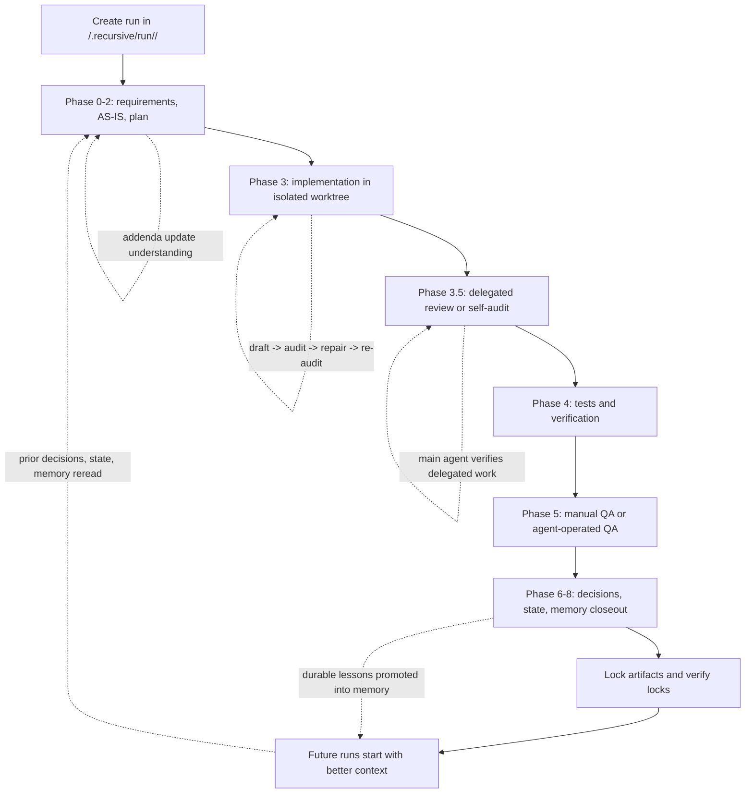

# recursive-mode

`recursive-mode` is an installable skill package for structured AI-assisted software development.

It gives an agent a file-backed workflow for requirements, planning, implementation, testing, review, closeout, and memory, instead of leaving that process in chat history alone.

## Who It Is For

- people who want a stricter, auditable agent workflow inside a repo
- teams who want requirements and implementation evidence recorded in files
- users who want installable subskills for worktrees, debugging, TDD, delegated review, and subagent support

## What It Includes

This repo currently ships these installable skills:

- `recursive-mode`
- `recursive-worktree`
- `recursive-debugging`
- `recursive-tdd`
- `recursive-review-bundle`
- `recursive-subagent`

## Functionality

The workflow package includes functionality for:

- turning a repo task into a staged, file-backed implementation run
- capturing requirements, analysis, plans, implementation evidence, and validation in durable artifacts
- enforcing audited phase progression with explicit pass/lock behavior
- isolating work in a dedicated git worktree before implementation begins
- running strict or pragmatic TDD with recorded RED/GREEN evidence
- recording QA in explicit human, agent-operated, or hybrid modes
- packaging delegated reviews into canonical review bundles
- recording and checking subagent contributions before they are accepted
- updating decisions, state, and memory as part of closeout
- maintaining reusable skill-memory and capability guidance over time

## Workflow Overview



At a high level, the workflow turns a task into a durable run, moves that run through audited phases, and then feeds validated outcomes back into decisions, state, and memory so later runs start from better context.

The main non-optional guardrails are:

- repository documents, not prompts, are the source of truth for requirements, plans, and phase inputs
- audited phases must pass through `draft -> audit -> repair -> re-audit -> pass -> lock`
- locked history is not rewritten; later corrections are handled through addenda and downstream reconciliation
- in-scope requirements need explicit dispositions and supporting implementation or verification evidence
- delegated work is not trusted on its own; the main agent must verify it against real files, diffs, and artifacts
- TDD, QA, review, and closeout all require explicit recorded modes, evidence, and phase outputs

## Benefits

Using the workflow can help you:

- keep important implementation context in repository files instead of losing it in chat history
- make agent work easier to audit, review, and resume later
- reduce vague “done” claims by requiring explicit evidence and phase completion records
- improve reliability through structured planning, testing, review, and closeout
- make delegated or subagent work safer by requiring controller verification
- preserve project decisions and operational lessons in a reusable form
- keep long-running agent work more consistent across sessions, contributors, and repositories

## Recursion

This workflow applies recursion in practice by making later work continuously refer back to, check, and refine earlier work.

In concrete terms:

- each phase consumes artifacts produced by earlier phases instead of starting from scratch
- audited phases repeatedly loop through `draft -> audit -> repair -> re-audit` until the work is actually ready
- downstream phases can correct or extend earlier understanding through addenda without rewriting locked history
- closeout phases feed validated lessons back into decisions, state, and memory so future runs can start from better context
- delegated review is recursive too: subagent work is not accepted on its own, but is reviewed again by the main agent against the repo’s real files, diffs, and artifacts

So the workflow is “recursive” not because it uses a programming-language recursion trick, but because the process repeatedly revisits its own outputs, uses them as inputs, and improves future work through structured feedback loops.

## Memory

The workflow includes a file-based memory layer under `/.recursive/memory/`.

In practice, that memory is used to store durable project knowledge such as:

- domain context
- reusable implementation patterns
- recurring incidents or failure modes
- capability and skill guidance
- lessons that were strong enough to keep beyond a single run

It is intentionally separated from:

- current repository state
- current decisions
- run-local working artifacts

That separation matters because it lets the workflow distinguish between:

- what is true right now
- what happened in one specific run
- and what has been learned repeatedly enough to be worth remembering long-term

Benefits of this memory model include:

- future runs can start from better context instead of rediscovering the same facts
- stable patterns and cautions can be reused across multiple tasks
- one-off session noise does not have to be treated as durable truth
- memory can be updated gradually as the codebase and workflow evolve
- skill-related knowledge, such as when a subskill helps or when a capability is missing, can become part of the workflow’s long-term operating knowledge

## Install

Install the main skill:

```bash
npx skills add try-works/recursive-mode
```

List everything in the package:

```bash
npx skills add try-works/recursive-mode --list
npx skills add try-works/recursive-mode --list --full-depth
```

Install all included skills:

```bash
npx skills add try-works/recursive-mode --skill '*' --full-depth
```

Install a single subskill:

```bash
npx skills add try-works/recursive-mode --skill recursive-tdd --full-depth
```

## Quick Start

After installing the skill package into your agent environment, the intended normal flow is:

1. open a target git repository
2. invoke recursive-mode with a short command such as `Implement the run`
3. if `/.recursive/` is missing, the skill should auto-bootstrap it before continuing

Manual bootstrap commands remain the fallback path when the runtime cannot auto-run the installer:

```bash
python "<SKILL_DIR>/scripts/install-recursive-mode.py" --repo-root .
bash "<SKILL_DIR>/scripts/install-recursive-mode.sh" --repo-root .
pwsh -NoProfile -File "<SKILL_DIR>/scripts/install-recursive-mode.ps1" -RepoRoot .
```

That creates the reusable `/.recursive/` scaffold, bridge docs, memory routers, and run layout used by the workflow.
The bundled installer carries its own canonical workflow template, so bootstrap works from the installed skill package even when hidden repo directories are not present in the package layout.

Important boundary:

- `npx skills add ...` installs the skill package into agent directories
- the target repo scaffold should then be created automatically on first recursive-mode use
- Python and Bash are first-class bootstrap paths, so macOS and Linux users do not need PowerShell
- if your runtime supports session-start hooks, the templates under `docs/templates/hooks/` can auto-bootstrap the scaffold at session start

From there, the canonical workflow contract lives in:

- `/.recursive/RECURSIVE.md`

If an agent is already inside the repo and needs a lightweight index of what to read under `/.recursive/`, start with:

- `/.recursive/AGENTS.md`

The installable root skill entrypoint is:

- `/SKILL.md`

## How To Start A Run

Once a repo is bootstrapped and the requirements or plan live in repository files, the user should be able to start or resume work with short commands instead of long prompts.

Examples:

- `Implement the run`
- `Implement run 75`
- `Implement requirement '75'`
- `Implement the plan`
- `Create a new run based on the plan`
- `Start a recursive run`

How those are interpreted:

- if a run id is explicit, the agent should use that run
- if no run id is given and there is exactly one active or incomplete run, the agent should resume it
- if the user refers to a plan, the agent should create a new run only when a unique source plan or requirements artifact can be identified from repo docs or immediate task context
- if the command is ambiguous, the agent should ask for the run id or the repo path of the source plan/requirements artifact

The important boundary is that prompts stay short and command-like, while the actual requirements and plan still live in repository documents.

## Repository Structure

High level:

```text
SKILL.md
skills/
scripts/
references/
.recursive/
```

- `SKILL.md`: installable root skill entrypoint
- `skills/`: installable subskills
- `scripts/`: bootstrap, lint, status, lock, bundle, closeout, smoke, and hygiene tools
- `references/`: templates and reusable guidance
- `.recursive/`: canonical workflow spec, internal routing/index docs, and durable repo-internal control-plane docs

## Historical Note

This repository evolved from the older `rlm-workflow` project. That name remains historical only; `recursive-mode` is the current product and package surface.
