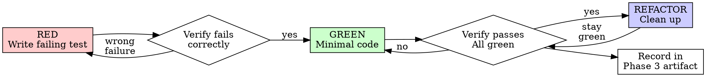

# recursive-tdd

## Overview

Test-Driven Development is mandatory for all recursive-mode implementation work. This skill ensures test-first discipline is followed rigorously and recorded in a way recursive-mode tooling can verify.

**Core Principle:** If you didn't watch the test fail, you don't know if it tests the right thing.

**The Iron Law for recursive-mode:**
```
NO PRODUCTION CODE WITHOUT A FAILING TEST FIRST
```

## Trigger examples

- `Implement Phase 3 for run '<run-id>'`
- `Add a failing regression test first, then fix the bug`
- `I already wrote the code; now add tests` (should trigger TDD reset guidance)
- `Follow RED-GREEN-REFACTOR for this change`

## When to Use

**Always in Phase 3 (Implementation):**
- New features
- Bug fixes
- Refactoring
- Behavior changes

**Default rule:**
- Not for "simple" changes
- Not when "under pressure"
- Not because "tests after achieve same goals"

**Explicit exception path only:**
- If strict RED-first flow is genuinely infeasible, declare `TDD Mode: pragmatic` in the Phase 3 artifact
- Record a concrete exception reason
- Record compensating validation evidence under `/.recursive/run/<run-id>/evidence/`
- Treat this as an explicit deviation, not a silent shortcut

## RED-GREEN-REFACTOR Cycle



### RED - Write Failing Test

Write one minimal test showing what should happen.

**Requirements:**
- One behavior per test
- Clear, descriptive name
- Test real code (no mocks unless unavoidable)
- Clear assertion showing expected outcome

<Good>
```typescript
test('rejects empty email with clear error message', async () => {
  const result = await submitForm({ email: '' });
  expect(result.error).toBe('Email is required');
});
```
</Good>

<Bad>
```typescript
test('email validation works', async () => {
  const mock = jest.fn().mockResolvedValue({ valid: true });
  const result = await validateEmail(mock);
  expect(mock).toHaveBeenCalled();
});
```
</Bad>

### Verify RED - Watch It Fail

**MANDATORY. Never skip.**

```bash
npm test path/to/test.test.ts
```

**Confirm:**
- Test fails (not errors)
- Failure message is expected
- Fails because feature missing (not typos)

**Record in Phase 3 artifact:**
```markdown
### TDD Cycle for R3 (Email Validation)

TDD Mode: strict

RED Evidence:
- `/.recursive/run/<run-id>/evidence/logs/red/<file>.log`

GREEN Evidence:
- `/.recursive/run/<run-id>/evidence/logs/green/<file>.log`

**RED Phase:**
- Test: `rejects empty email with clear error message`
- Command: `npm test src/forms/email.test.ts`
- Expected failure: "Email is required" not found
- Actual failure: [paste output]
- RED verified: PASS
```

### GREEN - Minimal Code

Write simplest code to pass the test.

**Rules:**
- Just enough to pass
- No additional features
- No "while I'm here" improvements
- No refactoring yet

<Good>
```typescript
function submitForm(data: FormData) {
  if (!data.email?.trim()) {
    return { error: 'Email is required' };
  }
  // ... rest of form handling
}
```
</Good>

<Bad>
```typescript
function submitForm(
  data: FormData,
  options?: {
    strictMode?: boolean;
    customValidators?: Validator[];
    onValidationError?: (err: Error) => void;
  }
) {
  // YAGNI - over-engineered
}
```
</Bad>

**Record in Phase 3 artifact:**
```markdown
**GREEN Phase:**
- Implementation: Added null check for email field
- Command: `npm test src/forms/email.test.ts`
- Result: PASS
- GREEN verified: PASS
```

### REFACTOR - Clean Up

After green only:
- Remove duplication
- Improve names
- Extract helpers
- Keep tests green

**Never add behavior during refactor.**

**Record in Phase 3 artifact:**
```markdown
**REFACTOR Phase:**
- Extracted `validateRequired(field, name)` helper
- Renamed `submitForm` to `processFormSubmission` for clarity
- All tests still passing: PASS
```

## Common Process Shortcuts (STOP)

| Excuse | Reality |
|--------|---------|
| "This is just a simple fix, no test needed" | Simple code breaks. Test takes 30 seconds. |
| "I'll test after confirming the fix works" | Tests passing immediately prove nothing. You never saw it catch the bug. |
| "Tests after achieve same goals" | Tests-after = "what does this do?" Tests-first = "what should this do?" |
| "I already manually tested it" | Ad-hoc != systematic. No record, can't re-run, no regression protection. |
| "Deleting working code is wasteful" | Sunk cost fallacy. Keeping unverified code is technical debt. |
| "TDD is dogmatic, I'm being pragmatic" | TDD IS pragmatic. Finds bugs before commit, enables refactoring. |
| "I'll keep the code as reference" | You'll adapt it. That's testing after. Delete means delete. |
| "Test hard = design unclear" | Listen to the test. Hard to test = hard to use. Simplify design. |
| "I need to explore first" | Fine. Throw away exploration, start TDD fresh. |
| "This is different because..." | It's not. The rules don't have exceptions. |

## Red Flags - STOP and Start Over

If you encounter any of these, DELETE CODE and restart with TDD:

- [X] Code written before test
- [X] Test passes immediately (not testing what you think)
- [X] "I'll add tests later"
- [X] "This is too simple to test"
- [X] "I know what I'm doing, I don't need the ritual"
- [X] Can't explain why test failed (or didn't fail)
- [X] Test testing mock behavior, not real behavior
- [X] Multiple behaviors in one test ("and" in test name)

## Integration with recursive-mode Phase 3

### Phase 3 Artifact TDD Section

Every Phase 3 artifact must include:

```markdown
## TDD Compliance Log

TDD Mode: strict

RED Evidence:
- `/.recursive/run/<run-id>/evidence/logs/red/<file>.log`

GREEN Evidence:
- `/.recursive/run/<run-id>/evidence/logs/green/<file>.log`

### Requirement R1 (Feature X)

**Test:** `test/features/x.test.ts` - "should do Y when Z"
- RED: [timestamp] - Failed as expected: [output]
- GREEN: [timestamp] - Minimal implementation: [description]
- REFACTOR: [timestamp] - Cleanups: [description]
- Final state: PASS - all tests passing

### Requirement R2 (Bug Fix)

**Regression Test:** `test/bugs/issue-123.test.ts` - "reproduces crash on empty input"
- RED: [timestamp] - Confirmed bug: [output]
- GREEN: [timestamp] - Fix applied: [description]
- REFACTOR: [timestamp] - N/A (minimal fix)
- Final state: PASS - test passes, bug fixed
```

If strict mode cannot be followed, the artifact must include:

```markdown
## Pragmatic TDD Exception

Exception reason: [specific reason strict RED-first flow was not feasible]
Compensating validation:
- [extra tests, targeted manual verification, diff review, etc.]
- `/.recursive/run/<run-id>/evidence/<supporting-file>`
```

### Phase 3 Coverage Gate Addition

```markdown
## Coverage Gate

- [ ] Every new function has a corresponding test
- [ ] Every bug fix has a regression test that fails before fix
- [ ] All RED phases documented with failure output
- [ ] All GREEN phases documented with minimal implementation
- [ ] All tests passing (no skipped tests)
- [ ] No production code written before failing test

TDD Compliance: PASS / FAIL
```

### Phase 3 Approval Gate Addition

```markdown
## Approval Gate

- [ ] TDD Compliance: PASS
- [ ] Implementation matches Phase 3 plan
- [ ] No code without preceding failing test
- [ ] All tests documented in TDD Compliance Log

Approval: PASS / FAIL
```

## Bug Fix TDD Procedure

1. **Add Regression Test First**
   - Write test that reproduces the bug
   - Run test, confirm it fails with expected error
   - Document failure in Phase 3 artifact

2. **Implement Minimal Fix**
   - Fix only what's needed to make test pass
   - Run test, confirm it passes
   - Document fix in Phase 3 artifact

3. **Verify No Regressions**
   - Run full test suite
   - Confirm nothing else broke
   - Document in Phase 3 artifact

4. **Lock Phase 3**
   - TDD Mode is declared
   - TDD Compliance: PASS
   - Approval: PASS
   - Status: LOCKED

## Example: Complete Phase 3 TDD Section

```markdown
## TDD Compliance Log

### R1: Add email validation

**Test:** `test/forms/validation.test.ts`

RED Phase (2026-02-21T10:15:00Z):
```bash
$ npm test test/forms/validation.test.ts
FAIL: Expected 'Email is required', got undefined
```
RED verified: PASS

GREEN Phase (2026-02-21T10:18:00Z):
- Added null check in `submitForm()` function
- Test passes
GREEN verified: PASS

REFACTOR Phase (2026-02-21T10:22:00Z):
- Extracted `validateRequired()` helper
- All tests still passing
REFACTOR complete: PASS

### R2: Fix crash on empty array

**Regression Test:** `test/utils/array.test.ts`

RED Phase (2026-02-21T10:25:00Z):
```bash
$ npm test test/utils/array.test.ts
FAIL: TypeError: Cannot read property 'map' of undefined
```
RED verified: Bug reproduced PASS

GREEN Phase (2026-02-21T10:27:00Z):
- Added guard clause in `processItems()`
- Test passes
GREEN verified: PASS

REFACTOR: N/A (minimal 2-line fix)

## Verification

Full suite run: `npm test`
Result: 47 passing, 0 failing
```

## References

- **REQUIRED:** Follow this skill for all Phase 3 implementation work
