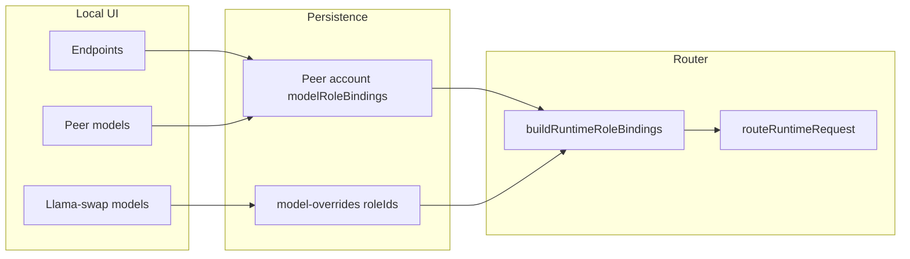

Run: `/.recursive/run/38-local-model-roles-peer-llama-swap-split/`
Phase: `00 Requirements`
Status: `LOCKED`
LockedAt: `2026-06-11T04:22:12Z`
LockHash: `2beff3bcc9d0cdd5f4309816b18641abf779564cc32d1455475f6b48f4354fc2`
Workflow version: `recursive-mode-audit-v2`
Inputs:
- `/.recursive/RECURSIVE.md`
- `/.recursive/STATE.md`
- `/.recursive/DECISIONS.md`
- `/.recursive/run/34-router-runtime-role-policy-and-ui-fixture-reduction/00-requirements.md`
- `/.recursive/run/37-downstream-openai-tool-turn-ingress/00-requirements.md` (packaged-runtime validation pattern)
- Conversation analysis: local peer vs llama-swap split, role-binding gaps, routing impact
- `role-model-router/apps/runtime-host-bridge/src/index.ts`
- `role-model-router/apps/runtime-ui/app/routes/local-models.tsx`
- `role-model-router/apps/runtime-ui/app/routes/local-peers.tsx`
- `role-model-router/apps/runtime-ui/app/lib/design-system.ts`
- `role-model-router/packages/provider-account/src/index.ts`
- `role-model-router/packages/core/src/router.ts`
- `role-model-router/apps/runtime-ui/DESIGN_SYSTEM.md`
- `/.recursive/run/38-local-model-roles-peer-llama-swap-split/addenda/ui-architecture-and-page-spec.md`
Outputs:
- `/.recursive/run/38-local-model-roles-peer-llama-swap-split/00-requirements.md`
- `/.recursive/run/38-local-model-roles-peer-llama-swap-split/addenda/ui-architecture-and-page-spec.md`
Scope note: Deliver local model role assignment and router consumption for **both** peer-backed and llama-swap local backends, and split the operator UI so peer and llama-swap workflows are never mixed on the same page. Operators should understand which backend they are using, assign roles at load time, and see those roles affect routing alongside remote models. **Authoritative UI architecture, navigation, and page-by-page layout/copy** live in the addendum; this document summarizes architecture and binds it to `R#` acceptance.

## TODO

- [x] Consolidate peer/llama-swap analysis into stable requirement identifiers
- [x] Define UI split and navigation model (peer page vs llama-swap page)
- [x] Document overall architecture changes (API, persistence, router bindings)
- [x] Document design-system navigation structure and page-by-page layout/copy (addendum)
- [x] Define role persistence and router binding contract for both backends
- [x] Write observable acceptance criteria per requirement
- [x] Record verification discipline (strict TDD + rebuild/launch + config parity + E2E routing regression loop + browser QA)
- [x] Record out-of-scope boundaries and constraints
- [x] User approval of this requirements artifact
- [x] Complete Coverage Gate checklist
- [x] Complete Approval Gate checklist

## Problem Summary

Today local models are routable but **not role-aware**:

| Backend | Operator entry | Role assignment today | Router bindings today |
| --- | --- | --- | --- |
| **Peer-backed** | Local → Endpoints, then Local → Models load | Hidden in Control → Models (account filter + validation block) | Only if `modelRoleBindings` exist on peer account; wiped on peer sync |
| **llama-swap** | Runtime config + Local → Models load (when no peers) | No surface | Never — `buildRuntimeRoleBindings` only walks SQLite runtime endpoints |

The Local → Models page copy says “llama-swap-managed” while `loadLocalModel` **prefers peers first**, which confuses operators. Peer and llama-swap must be **separate operator surfaces** with explicit backend labels, and both must support **role assignment at load/edit** that feeds `routeRuntimeRequest`.

Full navigation tables, route paths, section layouts, and shell/body copy: **`addenda/ui-architecture-and-page-spec.md`**.

## Overall architecture changes

### Data flow (summary)

| Concern | Peer-backed | Llama-swap |
| --- | --- | --- |
| Who runs inference | Operator’s OpenAI-compatible server | role-model llama-swap process |
| Operator setup | Local → Endpoints (URL + token) | System → Runtime config (`llama_swap.models`) |
| Model registration | Probe `/v1/models`, activate SQLite endpoint | Vendor load/swap via llama-swap |
| Role storage | `provider_accounts.modelRoleBindings` | `model-overrides.json` → `roleIds[]` |
| Router endpoint id | `local-openai-compatible.*.local.<model>` | `llama-swap.local.<slug>` |
| Load API (new) | `POST .../local/peer/models/:id/load` | `POST .../local/llama-swap/models/:id/load` |

### API split (replaces silent `loadLocalModel` preference)

The combined `loadLocalModel` path that tries peers first then llama-swap is **deprecated for UI use**. Split endpoints make backend choice explicit; legacy unified endpoint may remain temporarily for scripts with deprecation note in Phase 2.

### Shared UI primitive

`LocalModelRolePicker` — checkbox list from live role policy, reused on both model pages (specified in addendum §1.4).

## Design system & navigation structure (summary)

**Local** sidebar becomes two ordered clusters (see addendum §2.2):

**Peer cluster**

1. **Endpoints** — `/app/local/endpoints`
2. **Peer models** — `/app/local/peer-models`

**Llama-swap cluster** (all shell titles/descriptions prefix “Llama-swap”)

3. **Models** — `/app/local/llama-swap/models`
4. **Swap history** — `/app/local/llama-swap/swap`
5. **Host policy** — `/app/local/llama-swap/policy`
6. **Logs** — `/app/local/llama-swap/logs`
7. **Matrix** — `/app/local/llama-swap/matrix`

**Chooser:** `/app/local/choose` — explains both backends; legacy `/app/local/models` redirects here.

**Redirects:** `/app/local/swap|policy|logs|matrix` → matching `/app/local/llama-swap/*` paths.

`DESIGN_SYSTEM.md` Local section, route inventory table, and live route layout sections (`Local > Models`, `Local > Peers`, etc.) must be rewritten to match the addendum before route implementation (`R10`).

## Page-by-page layout & copy (summary)

| Route | Template | Primary operator action |
| --- | --- | --- |
| `/app/local/choose` | `registry-detail` | Pick peer vs llama-swap workflow (no load) |
| `/app/local/endpoints` | `registry-detail` | Add/remove peer server URLs |
| `/app/local/peer-models` | `registry-detail` | Register model + roles; edit roles on cards |
| `/app/local/llama-swap/models` | `registry-detail` | Load/swap model + roles; unload; overrides |

**Shell copy examples (authoritative text in addendum §3):**

- **Peer models description:** “Register models available on your peer endpoints and assign runtime roles for routing.”
- **Llama-swap models description:** “Load models managed by the role-model llama-swap process and assign runtime roles. Swapping unloads the previous model when only one slot is available.”
- **Endpoints description:** “Register OpenAI-compatible servers you operate. This is the peer backend only — not used for llama-swap.”

**Key UX rules:**

- Peer model cards: **no Unload** (VRAM owned by peer server); use “Re-register” / “Remove from router”.
- Llama-swap model cards: **Load / Reload / Unload** retained.
- Both pages: role picker on register/load form + “Edit roles” disclosure on each card.
- Backend badge on every card: `Peer-backed` or `Llama-swap`.
- Empty states name the correct prerequisite page (Endpoints vs Runtime config).

## Fixed Guidance

1. **Peer and llama-swap are different execution backends.** Peer = operator-run server. llama-swap = role-model-run swap manager. UI must never imply they are the same.
2. **Role assignment is an operator action on the local model surface**, not a hidden Control → Models workaround.
3. **`buildRuntimeRoleBindings` / `getEndpointRoleIds` must resolve bindings for registry local endpoints** (`llama-swap.local.*`) as well as SQLite peer endpoints.
4. **Peer account wildcard semantics must align with role bindings:** empty `allowedModels` means “any model on this endpoint” for activation **and** for `modelRoleBindings` validation (mirror `isModelAllowed` in endpoint-registry).
5. **`syncLocalPeerState` must merge persisted `modelRoleBindings` / per-model `allowedModels`**, not overwrite them with `createLocalPeerAccount()` defaults.
6. **Design-system-first:** update `DESIGN_SYSTEM.md` and `design-system.ts` navigation metadata before implementing split routes.

## Verification Discipline

| Layer | When | Gate |
| --- | --- | --- |
| Strict TDD (Phase 3) | Before each production change | Failing test first (RED), then implementation (GREEN), evidence logged |
| Package tests (Phase 4) | After implementation | `runtime-host-bridge`, `provider-account`, `runtime-ui` view-model tests PASS |
| Packaged runtime E2E (Phase 5) | After `runtime:package-sea` rebuild | Role bindings visible on `listEndpoints` / router candidates; routing proof on live `:3456` |
| Operator-path regression (Phase 5) | Rebuilt runtime launched + config restored | End-to-end routing suite PASS; iterate fix→rebuild→retest until green |
| Browser QA (Phase 5) | Same rebuilt runtime | Split pages render correct backend; role save on load persists |

`TDD Mode` for Phase 3 implementation: **`strict`**.

`QA Execution Mode` for Phase 5: **`agent-operated`** for rebuild, launch, config parity, and routing regression execution; **hybrid** for split-UI clarity sign-off (`R9`).

### Operator configuration baseline (post-rebuild parity)

Final verification must restore the **current working operator setup** on the rebuilt packaged runtime at `http://127.0.0.1:3456` (bearer `role-model-local`), matching pre-rebuild capture in `evidence/logs/runtime-config-baseline-pre-rebuild.json`:

| Asset | Baseline value (current operator setup) |
| --- | --- |
| Local peer model | `lfm2.5-8b-a1b` loaded/registered via peer endpoint |
| Remote model | `moonshot/kimi-k2.6` on `moonshot.personal.kimi-code` (or equivalent active Moonshot account) |
| Routing alias | `mixed.local-remote` pool includes local + remote model ids |
| Downstream auth | Bearer `role-model-local` |

Config parity steps (minimum):

1. `POST /api/role-model/local/models/lfm2.5-8b-a1b/load` (or split peer load API after `R2`) once peer endpoint is configured.
2. `POST /api/role-model/endpoints` (or existing account upsert) for remote Kimi account + model activation as today.
3. Verify `GET /v1/models` lists `mixed.local-remote`, `lfm2.5-8b-a1b`, and `moonshot/kimi-k2.6`.
4. Assign runtime roles on the local peer model via the new Peer models UI (run 38 feature) without breaking remote role bindings.

### Phase 5 iterate-until-green loop (mandatory)

After Phase 3/4 code is green in the worktree, acceptance is **not** complete until the operator-path regression suite passes on a **rebuilt and launched** runtime:

1. Capture pre-rebuild baseline (`runtime-config-baseline-pre-rebuild.json`).
2. `corepack pnpm run runtime:package-sea`; record artifact SHA256.
3. Stop prior runtime process if port `:3456` is occupied; launch rebuilt `Role-Model.bat` (or SEA equivalent).
4. Restore operator config parity (table above).
5. Run end-to-end routing regression suite (`R11`); save logs under `evidence/logs/green/`.
6. If any case fails or functionality regresses: diagnose → fix in worktree → return to step 2 (rebuild) → relaunch → reconfigure → retest.
7. Lock Phase 5 only when the suite is green **and** run 38 feature scenarios (`R7`) pass on the same runtime session.

No `verified` disposition on `R7`, `R9`, or `R11` from worktree unit tests alone.

## Requirements

### `R1` Split Local UI into peer and llama-swap model pages

Description:
Replace the mixed Local → Models experience with the navigation, routes, layouts, and copy defined in `addenda/ui-architecture-and-page-spec.md`. Each page must state which backend it controls, what prerequisite setup is required, and must not expose the other backend’s load controls.

Acceptance criteria:
- Implementation matches addendum §2 (navigation), §3 (page layouts and copy), and §2.4 (backend badges).
- Routes exist: `/app/local/choose`, `/app/local/peer-models`, `/app/local/llama-swap/models`, and llama-swap satellite paths under `/app/local/llama-swap/*`.
- Peer models page lists **only** `localModelSource: "peer-backed"`; llama-swap page lists **only** `"llama-swap"`.
- Legacy `/app/local/models` redirects to `/app/local/choose`; legacy swap/policy/logs/matrix paths redirect per addendum §2.2.
- `LocalModelRolePicker` shared component used on both model pages (load form + card edit).
- Browser QA screenshots under `evidence/screenshots/` capture chooser, peer models, and llama-swap models shell headers and prerequisite empty states.

### `R2` Role assignment on peer model load and edit

Description:
Operators must assign runtime role ids when loading or editing a peer-backed local model. Bindings must persist on the peer provider account and survive peer list updates.

Acceptance criteria:
- Peer models page exposes role multi-select (from live role policy) on **load** and for already-registered models.
- `POST /api/role-model/local/peer/models/:modelId/load` and `PUT .../roles` accept `roleIds` per addendum §1.2 (empty array clears bindings).
- On successful peer load, the backing `local-openai-compatible` account stores `modelRoleBindings` for the `modelId` and includes the `modelId` in `allowedModels` when bindings are non-empty (or validation accepts wildcard empty `allowedModels` per `R4`).
- `syncLocalPeerState` merges existing SQLite account `modelRoleBindings` and `allowedModels` when refreshing peer accounts — re-saving endpoints does not wipe roles.
- Control → Models inspect panel lists peer accounts for the model (fix `selectedModelAccounts` filter for wildcard peer accounts with active endpoints).
- Strict TDD: failing `runtime-host-bridge` and/or `provider-account` tests precede persistence/validation fixes (RED/GREEN logs recorded).

### `R3` Role assignment on llama-swap model load and edit

Description:
Operators must assign runtime role ids when loading or editing llama-swap-managed local models. Bindings must feed router role resolution for `llama-swap.local.*` endpoints.

Acceptance criteria:
- Llama-swap models page exposes role multi-select on **load** and for configured/loaded llama-swap models.
- `POST /api/role-model/local/llama-swap/models/:modelId/load` and `PUT .../roles` accept `roleIds` and persist to `model-overrides.json` `roleIds[]` per addendum §1.3 (unless Phase 2 documents a stronger seam with addendum revision).
- `GET /api/role-model/local/models` (or split read APIs) returns `roleIds` per llama-swap model.
- `listEndpoints()` and router candidate readback show non-empty `roleBindings` / `roleIds` for `llama-swap.local.<model>` when roles are assigned.
- llama-swap load/unload behavior unchanged except for role persistence sidecar (no regression to swap execution).
- Strict TDD: failing tests precede binding persistence and readback implementation (RED/GREEN logs recorded).

### `R4` Provider-account validation aligned with peer wildcard semantics

Description:
`validateProviderAccounts` must allow `modelRoleBindings` on peer accounts that use empty `allowedModels` as a wildcard, consistent with endpoint activation and `isModelAllowed`.

Acceptance criteria:
- Saving peer `modelRoleBindings` without pre-populating `allowedModels` passes validation when the account is a local peer account (or when `allowedModels.length === 0` wildcard policy applies).
- `MODEL_ROLE_MODEL_NOT_ALLOWED` is not emitted for valid peer wildcard bindings.
- Remote account validation behavior unchanged (bindings still require model in `allowedModels` for non-wildcard accounts).
- `provider-account` unit tests cover peer wildcard binding acceptance and preserve existing remote rejection cases.

### `R5` Router dynamic bindings cover all local endpoint kinds

Description:
`buildRuntimeRoleBindings` and `getEndpointRoleIds` must derive active bindings from registry endpoints for both SQLite peer endpoints and registry-only llama-swap local sources.

Acceptance criteria:
- Assigned roles on a peer-backed endpoint produce dynamic bindings consumed by `routeRuntimeRequest` (same shape as remote `modelRoleBindings`-derived bindings).
- Assigned roles on a llama-swap endpoint produce dynamic bindings for `llama-swap.local.<slug(modelId)>`.
- `readRouterConfigData().policySources.roleBindings` includes bindings for at least one peer and one llama-swap endpoint in fixture or integration tests.
- When `requestedRoleId` is set, a local endpoint with an active binding receives the existing `active_role_binding` preference adjustment in router scoring (no hard exclusion solely for missing binding).
- No duplicate bindings for the same `(endpoint_id, role_id)` pair.

### `R6` Control and observe surfaces show honest local role coverage

Description:
Downstream operator surfaces must reflect local role assignments without requiring the legacy mixed Local → Models page.

Acceptance criteria:
- `buildConfiguredModelCards` includes role ids from local endpoints (peer and llama-swap) after assignment.
- Router → Candidates rows show `roleBindings` for local endpoints when roles are assigned.
- Telemetry endpoint meta (`roleIds` on request records) matches assigned roles after a routed request.
- Empty states remain honest when no roles are assigned (no fixture placeholders).

### `R7` Routing proof with mixed local + remote alias

Description:
Prove that role-assigned local models participate in live routing on an alias pool that includes remote models (e.g. `mixed.local-remote`).

Acceptance criteria:
- Packaged runtime on `:3456` with config parity documented in `evidence/logs/runtime-config-baseline-pre-rebuild.json`.
- Scenario A (peer): assign role `general.chat` (or operator-defined role) to a loaded peer local model; send chat request via alias with `x-role-model-requested-role-id` or controller-guided role; telemetry shows local endpoint selected when difficulty/policy favors local and capabilities match.
- Scenario B (llama-swap): with `llama_swap` enabled and at least one configured model, assign the same role; routing decision or candidate ranking shows active binding on `llama-swap.local.*`.
- Evidence logs under `evidence/logs/green/` record HTTP requests, routing decision ids, and endpoint ids for A and B.
- Regression: remote role-bound endpoints still route correctly (no remote regression).

### `R8` Strict TDD with recorded RED/GREEN evidence

Description:
All production changes for `R2`–`R5` follow strict failing-test-first discipline.

Acceptance criteria:
- Phase 3 declares `TDD Mode: strict`.
- RED/GREEN logs under `evidence/logs/` for at minimum:
  - `provider-account` validation (peer wildcard)
  - `runtime-host-bridge` binding resolution + peer sync merge
  - `runtime-ui` view-model or route tests for split pages (if applicable)
- Phase 4 `04-test-summary.md` cites exact test commands and PASS output.

### `R10` Design system documentation matches split Local IA

Description:
`DESIGN_SYSTEM.md` and `design-system.ts` must document the peer vs llama-swap information architecture before page routes ship.

Acceptance criteria:
- `DESIGN_SYSTEM.md` Local section prose matches addendum §2.1 (two backends, never combined on one page).
- Route inventory table lists all new paths, templates, and shell descriptions from addendum §2.2.
- Live route layout sections replace `Local > Models` with `Local > Choose`, `Local > Peer models`, `Local > Llama-swap models`, and updated satellite page layouts.
- `runtimeNavigationSections` Local items ordered: peer cluster then llama-swap cluster.
- `design-system.ts` route metadata matches addendum shell title/description strings exactly for changed routes.
- All operator-facing strings use **role-model**, never “Role Model” (constraints section).

### `R9` Packaged runtime rebuild, launch, and hybrid browser QA

Description:
Final acceptance uses the operator delivery path: stop any prior runtime, rebuild SEA package, **launch** the new runtime on `:3456`, restore operator config parity, then verify split UI in the browser.

Acceptance criteria:
- **Pre-rebuild baseline** captured to `evidence/logs/runtime-config-baseline-pre-rebuild.json` (models, endpoints, accounts, alias membership, artifact SHA256 if known).
- Rebuild via `corepack pnpm run runtime:package-sea` in `role-model-router`; record post-build artifact path and SHA256 in `evidence/logs/` and Phase 4/5 artifacts.
- Prior `:3456` process stopped cleanly when required (`taskkill` or operator stop); relaunch documented in `05-manual-qa.md`.
- Launched runtime responds on `http://127.0.0.1:3456` with the same downstream contract (`role-model-local` bearer).
- **Config parity restored** per operator baseline table: local `lfm2.5-8b-a1b` peer model + remote `moonshot/kimi-k2.6` + `mixed.local-remote` alias; `GET /v1/models` matches baseline model/alias ids (endpoint id churn allowed for peer uuid only).
- `05-manual-qa.md` checklist includes:
  - Navigate Peer models page → register/load `lfm2.5-8b-a1b` with roles → verify endpoints/candidates
  - Navigate Llama-swap models page → load model with roles when llama-swap enabled (optional path)
  - Confirm `/app/local/choose` and split pages match addendum copy; legacy `/app/local/models` redirects to chooser
- Hybrid QA: user sign-off on UI clarity recorded in Phase 5 artifact (or explicit approval comment).
- `R11` routing regression suite green on this same launched runtime before Phase 5 lock.

### `R11` End-to-end routing regression on rebuilt runtime (no functionality lost)

Description:
After run 38 implementation, prove on a **rebuilt, launched, and reconfigured** packaged runtime that existing routing and downstream behavior still works, and that new local role features work on top. Failures trigger fix → rebuild → relaunch → reconfigure → retest until green.

Acceptance criteria:
- Regression suite script or documented command sequence lives under `role-model-router/scripts/` or `/.recursive/run/38-.../evidence/scripts/` and is cited in `05-manual-qa.md`.
- Suite runs against live `:3456` after config parity (`R9`); output saved to `evidence/logs/green/routing-regression-<date>.log`.
- **Baseline routing (must still PASS — no regression):**
  - `POST /v1/chat/completions` model `mixed.local-remote`, simple user message → HTTP 200, non-empty assistant content, real `endpointId` in telemetry (not `unknown.endpoint`).
  - Direct `lfm2.5-8b-a1b` chat completion → routes to peer-backed local endpoint when requested explicitly or via alias pool.
  - Direct `moonshot/kimi-k2.6` chat completion → routes to remote Kimi endpoint.
  - First-turn tool request on `mixed.local-remote` (run 37 `A2` class) → HTTP 200 without bridge 400.
  - Tool-turn follow-up on `mixed.local-remote` (run 37 `B1` or `B3` class) → no bridge `400` / `Cannot read properties of null`; provider may error but bridge ingress must not crash.
  - `python role-model-router/scripts/probe-downstream-ingress.py` against `:3456` → **0 `BRIDGE_CRASH`** (run 37 regression guard).
- **Run 38 feature routing (must PASS):**
  - After assigning roles on peer `lfm2.5-8b-a1b` via Peer models UI/API: `GET /api/role-model/endpoints` and router candidates show non-empty `roleIds` on the local endpoint.
  - Request with `x-role-model-requested-role-id` matching an assigned local role can select the local endpoint when policy favors local (telemetry `endpointId` is peer-backed local).
  - Remote Kimi role bindings unchanged and still win routing when local lacks the requested role binding.
- **Iterate until green:** any failure blocks Phase 5 lock; controller records each repair iteration in `05-manual-qa.md` with log paths until all cases PASS on a single post-rebuild runtime session.
- Phase 5 declares `QA Execution Mode: agent-operated` for suite execution; hybrid sign-off only for subjective UI clarity items in `R9`.

## Out of Scope

- `OOS1`: Unifying peer and llama-swap into a single backend implementation (UI split only; internal dual backends may remain)
- `OOS2`: Changing llama-swap vendor swap algorithm, TTL semantics, or process supervision
- `OOS3`: Auto-detecting which backend an operator “meant” on a single combined load form
- `OOS4`: Full role-definition authoring changes (covered by run 34); this run consumes existing role policy
- `OOS5`: Pi/downstream ingress message-shape fixes (run 37)
- `OOS6`: Routing strategy / difficulty classifier / controller model changes unless required for routing proof wiring
- `OOS7`: Committing operator secrets into evidence logs

## Constraints

- Design-system-first for all runtime UI navigation and page metadata changes
- **Product naming:** all operator-facing copy uses **role-model** (lowercase, hyphenated), never “Role Model”
- Minimize diff scope: prefer extending existing persistence (`model-overrides.json`, provider accounts) over new parallel config systems unless Phase 2 documents a stronger seam
- Preserve existing peer endpoint activation when `allowedModels` is empty
- Do not break remote `modelRoleBindings` validation or Providers onboarding
- Packaged-runtime validation on `:3456` is mandatory for `verified` disposition on `R7`, `R9`, and `R11`
- Rebuild → launch → config parity → routing regression → iterate until green is mandatory before run closeout; no “code complete” without green `R11` on launched SEA runtime
- Operator regression baseline uses local `lfm2.5-8b-a1b` + remote `moonshot/kimi-k2.6` + `mixed.local-remote` unless an addendum revises the capture
- Strict TDD mandatory (`R8`)

## Assumptions

- Operators may use **peer only**, **llama-swap only**, or **both**; the UI split must support all three without forcing llama-swap enablement
- Role policy from run 34 remains the source of assignable role ids
- `mixed.local-remote` remains the primary routing proof alias; local `lfm2.5-8b-a1b` and remote `moonshot/kimi-k2.6` remain the primary regression models
- A working pre-run operator runtime on `:3456` exists to capture baseline config before the first post-implementation rebuild

## Open Unknowns (resolve in Phase 1 AS-IS)

1. Whether `model-overrides.json` is the best persistence seam for llama-swap `roleIds` vs a dedicated `local-model-role-bindings.json` (Phase 2 must decide and document).
2. Whether peer load should auto-add `modelId` to `allowedModels` on bind-save or rely solely on wildcard validation relaxation (`R4`).
3. ~~Exact redirect behavior for legacy `/app/local/models` bookmarks~~ **Resolved:** redirect to `/app/local/choose` (addendum §2.2).

## Coverage Gate

- [x] UI split, navigation, layouts, and copy map to `R1`, `R10`, and addendum
- [x] Architecture/API/persistence summary maps to `R2`–`R5` and addendum §1
- [x] Peer role assignment + persistence maps to `R2`, `R4`
- [x] llama-swap role assignment maps to `R3`
- [x] Router binding resolution maps to `R5`
- [x] Observe/control readback maps to `R6`
- [x] Live routing proof maps to `R7`
- [x] Rebuild, launch, config parity, and browser QA map to `R9`
- [x] End-to-end routing regression and iterate-until-green map to `R11`
- [x] TDD maps to `R8`
- [x] Out-of-scope prevents backend unification creep
- [x] User approved the requirements artifact (closeout 2026-06-08)

Coverage: PASS

## Approval Gate

- [x] Requirements are bounded to local role parity and UI split
- [x] Both peer and llama-swap explicitly in scope
- [x] Acceptance criteria are observable via API, UI, telemetry, and routing evidence
- [x] Strict TDD, packaged-runtime rebuild/launch, config parity, and iterative routing regression are explicit (`R8`, `R9`, `R11`)
- [x] User approved proceeding to Phase 1/2 (closeout 2026-06-08)

Approval: PASS

Audit: PASS
