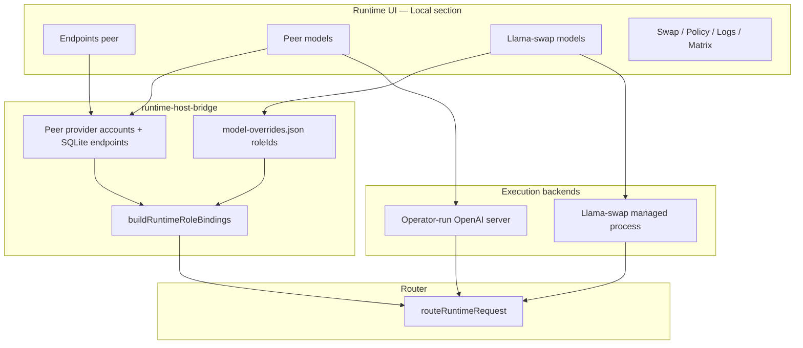

Run: `/.recursive/run/38-local-model-roles-peer-llama-swap-split/`
Phase: `Addendum — UI architecture and page spec`
Status: `LOCKED`
LockedAt: `2026-06-11T04:23:10Z`
LockHash: `686be673bcb6fecb6a319f933058617d62658cb01dffb9e91b3ed1d9125309fa`
Workflow version: `recursive-mode-audit-v2`
Inputs:
- `/.recursive/run/38-local-model-roles-peer-llama-swap-split/00-requirements.md`
Outputs:
- `/.recursive/run/38-local-model-roles-peer-llama-swap-split/addenda/ui-architecture-and-page-spec.md`
Scope note: Authoritative UI architecture, navigation, shell metadata, and page copy for run 38 split Local IA.
Parent: `00-requirements.md`

# Addendum: UI architecture, design system structure, and page specifications

This addendum is authoritative for layout, navigation, shell metadata, section copy, and empty-state contracts. Phase 2 planning must not contradict it without a numbered addendum revision.

**Product naming:** operator-facing copy uses **role-model** (lowercase, hyphenated), never “Role Model”.

---

## 1. Overall architecture changes

### 1.1 Operator mental model (two local backends)

| Layer | Today | After run 38 |
| --- | --- | --- |
| **UI** | Single `local-models` mixes peer + llama-swap | Split routes; backend badge on every model card |
| **Load API** | One `loadLocalModel` prefers peers silently | Explicit peer vs llama-swap load endpoints |
| **Role persistence** | Remote accounts only (effectively) | Peer → `modelRoleBindings` on account; llama-swap → `roleIds` in overrides store |
| **Binding resolution** | SQLite runtime endpoints only | Registry-wide: peer SQLite + `llama-swap.local.*` |
| **Navigation** | “Models” implies generic local | Peer block vs llama-swap block with distinct labels |

### 1.2 Backend API surface (new split)

| Method | Path | Purpose |
| --- | --- | --- |
| `GET` | `/api/role-model/local/peer/models` | Peer-backed models only (`localModelSource: peer-backed`) |
| `POST` | `/api/role-model/local/peer/models/:modelId/load` | Body: `{ roleIds?: string[] }` — register + bind roles |
| `PUT` | `/api/role-model/local/peer/models/:modelId/roles` | Body: `{ roleIds: string[] }` — edit bindings |
| `GET` | `/api/role-model/local/llama-swap/models` | llama-swap models only |
| `POST` | `/api/role-model/local/llama-swap/models/:modelId/load` | Body: `{ roleIds?: string[] }` — swap load + bind |
| `PUT` | `/api/role-model/local/llama-swap/models/:modelId/roles` | Body: `{ roleIds: string[] }` |
| `GET` | `/api/role-model/local/models` | **Deprecated read** — returns both with `localModelSource` (keep for transition) or 301 to split reads (Phase 2 decides) |

Peer endpoints CRUD unchanged: `/api/role-model/local/peers`.

### 1.3 Persistence seams

| Backend | Store | Fields added/changed |
| --- | --- | --- |
| Peer | `provider_accounts` via peer account | `modelRoleBindings[]`, merged on `syncLocalPeerState` |
| llama-swap | `model-overrides.json` | `roleIds: string[]` per modelId (alongside ttl, contextWindow, concurrencyLimit) |

`buildRuntimeRoleBindings` reads both seams and emits router `roleBindings` for all local endpoint ids.

### 1.4 Shared UI component: `LocalModelRolePicker`

New repo-owned primitive (under `components/` or `routes/local/` shared module):

- Checkbox list from `fetchRolePolicy().roleDefinitions`
- Helper text: “Roles control which routing tasks can select this model.”
- Link to `/app/models/roles` as secondary action
- Used on: peer load form, peer model cards, llama-swap load form, llama-swap model cards
- **Not** used on Endpoints page

---

## 2. Design system & navigation structure

### 2.1 `DESIGN_SYSTEM.md` — Local section rewrite

Replace the single “Local inference runtime…” blurb with:

> **Local** — Two local inference backends: **peer** (you run the server) and **llama-swap** (role-model runs the swap manager). Peer and llama-swap pages are never combined. Role assignment happens on the model page for the backend in use.

### 2.2 Navigation model (`design-system.ts`)

Introduce **nav grouping labels** inside the Local section using two consecutive item clusters (no new section type required — ordering + naming carries the split):

**Cluster A — Peer (external server)**

| `id` | `to` | `label` | `title` | `description` |
| --- | --- | --- | --- | --- |
| `local-endpoints` | `/app/local/endpoints` | Endpoints | Local endpoints | Register OpenAI-compatible servers you operate. Required before loading peer models. |
| `local-peer-models` | `/app/local/peer-models` | Peer models | Peer models | Register models from your endpoints with the router and assign runtime roles. |

**Cluster B — Llama-swap (managed)**

| `id` | `to` | `label` | `title` | `description` |
| --- | --- | --- | --- | --- |
| `local-llama-swap-models` | `/app/local/llama-swap/models` | Models | Llama-swap models | Load and swap models managed by the role-model llama-swap process. Assign runtime roles per model. |
| `local-llama-swap-swap` | `/app/local/llama-swap/swap` | Swap history | Llama-swap swap history | Chronological llama-swap load and swap events. |
| `local-llama-swap-policy` | `/app/local/llama-swap/policy` | Host policy | Llama-swap host policy | TTL, auto-unload, and concurrency for the managed llama-swap runtime. |
| `local-llama-swap-logs` | `/app/local/llama-swap/logs` | Logs | Llama-swap logs | Live proxy and upstream logs from the llama-swap process. |
| `local-llama-swap-matrix` | `/app/local/llama-swap/matrix` | Matrix | Llama-swap matrix | Grid of concurrently loaded llama-swap models. |

**Legacy routes (redirects)**

| Old path | New target |
| --- | --- |
| `/app/local/models` | `/app/local/choose` (backend chooser) |
| `/app/local/swap` | `/app/local/llama-swap/swap` |
| `/app/local/policy` | `/app/local/llama-swap/policy` |
| `/app/local/logs` | `/app/local/llama-swap/logs` |
| `/app/local/matrix` | `/app/local/llama-swap/matrix` |

### 2.3 Route registry (`routes.ts`)

Add:

- `local/choose` → `local-choose.tsx` (chooser)
- `local/peer-models` → `local-peer-models.tsx`
- `local/llama-swap/models` → `local-llama-swap-models.tsx`
- Move or alias swap/policy/logs/matrix under `local/llama-swap/*`

Remove combined load logic from deprecated `local-models.tsx` (file becomes redirect-only or deleted after redirects wired).

### 2.4 Visual backend badge contract

Every model card on peer or llama-swap pages displays a `StatusPill`:

| Backend | Pill label | Tone |
| --- | --- | --- |
| Peer | `Peer-backed` | `neutral` + `--rm-telemetry-local` border accent |
| llama-swap | `Llama-swap` | `neutral` + mono uppercase tracking |

Role pills below model id: `StatusPill tone="neutral"` per assigned role, or `tone="warning"` “No roles” when empty.

### 2.5 Cross-links (handoff matrix)

| From | Link text | To |
| --- | --- | --- |
| Peer models (no endpoints) | Configure endpoints first | `/app/local/endpoints` |
| Peer models | Manage role definitions | `/app/models/roles` |
| Llama-swap models (vendor inactive) | Enable llama-swap in runtime config | `/app/system/runtime-config` |
| Llama-swap models | Manage role definitions | `/app/models/roles` |
| Either model card | View router candidates | `/app/router/candidates` |
| Models inventory | Inspect model (unified) | `/app/models` (read-only roles still visible) |

---

## 3. Page-by-page layout & copy

Shell header fields come from `RuntimeRouteDefinition` — **routes must not duplicate title blocks in page body.**

Template assignments:

| Page | Template |
| --- | --- |
| Choose backend | `registry-detail` (two-card chooser) |
| Endpoints | `registry-detail` (unchanged structure) |
| Peer models | `registry-detail` |
| Llama-swap models | `registry-detail` |
| Swap / Policy / Logs / Matrix | unchanged templates, updated shell metadata only |

---

### 3.1 `/app/local/choose` — Local backend chooser

**Shell**

- Section: `Local`
- Title: `Choose local backend`
- Description: `Peer and llama-swap are different ways to run models on this machine. Pick the workflow that matches how you host inference.`

**Layout**

1. `FactCard` row — two columns on `md+`, stacked on mobile
2. No load controls on this page

**Card A — Peer**

- Eyebrow: `External server`
- Title: `Peer-backed models`
- Body copy:
  > Use this when you already run an OpenAI-compatible server (LM Studio, llama.cpp, vLLM, or similar). Register the server under **Endpoints**, then register models and roles here. role-model routes to your server; it does not load GGUF files for you.
- Primary CTA: `Open peer models` → `/app/local/peer-models`
- Secondary CTA: `Configure endpoints` → `/app/local/endpoints`

**Card B — Llama-swap**

- Eyebrow: `Managed by role-model`
- Title: `Llama-swap models`
- Body copy:
  > Use this when role-model should run the local llama-swap process, swap models on one GPU, and apply TTL auto-unload. Models are declared in **Runtime config**; load and role assignment happen here.
- Primary CTA: `Open llama-swap models` → `/app/local/llama-swap/models`
- Secondary CTA: `Edit runtime config` → `/app/system/runtime-config`

---

### 3.2 `/app/local/endpoints` — Peer endpoints (updated copy only)

**Shell**

- Title: `Local endpoints` *(unchanged)*
- Description: `Register OpenAI-compatible servers you operate. This is the peer backend only — not used for llama-swap.`

**Section: Endpoint inventory**

- Title: `Endpoint inventory`
- Description: `role-model probes each server at \`/v1/models\` before peer models can be registered.`

**Empty state**

- Label: `No peer endpoints configured. Add a server URL below to use peer-backed local models.`

**Section: Add local endpoint**

- Title: `Add peer endpoint`
- Description: `Base URL of your OpenAI-compatible API (with or without \`/v1\`). Optional bearer token if the server requires auth.`
- URL placeholder: `http://127.0.0.1:1234`
- Token placeholder: `Bearer token (optional)`
- Primary button: `Add endpoint`

**Footer hint (muted panel)**

> Peer endpoints do not assign router roles. After adding a server, open **Peer models** to register models and choose roles.

---

### 3.3 `/app/local/peer-models` — Peer models + roles

**Shell**

- Title: `Peer models`
- Description: `Register models available on your peer endpoints and assign runtime roles for routing.`

**Page actions (header)**

- `Refresh`

**Section 1: Prerequisites** (collapsed when ≥1 peer healthy)

- Title: `Prerequisites`
- When no peers: `FactCard` warning tone
  - Copy: `Configure at least one peer endpoint before registering models.`
  - CTA: `Open endpoints` → `/app/local/endpoints`

**Section 2: Register peer model**

- Title: `Register model`
- Description: `Model ID must appear in \`GET /v1/models\` on a configured endpoint. Registration adds a router endpoint; it does not download weights.`
- Fields:
  - Model ID (text, placeholder: `lfm2.5-8b-a1b`)
  - **Runtime roles** — `LocalModelRolePicker` (optional multi-select)
- Primary button: `Register model`
- Inline helper under roles:
  > Roles determine which tasks and aliases may prefer this endpoint. Leave empty to register without role coverage.

**Section 3: Registered peer models**

- Title: `Registered models`
- Description: `Models currently registered with the router from peer endpoints.`
- Empty state: `No peer models registered. Add a model ID above after configuring endpoints.`

**Per-model card (list template)**

| Row | Content |
| --- | --- |
| Header | Model ID (mono), pill `Peer-backed`, pill `Registered` |
| Metadata grid | Endpoint account id, source URL (from peer), loaded/registered at |
| Roles | Assigned role pills or warning `No roles` |
| Role editor | Collapsed `DisclosureSection` “Edit roles” with picker + `Save roles` |
| Actions | `Re-register` (reload), `Remove from router` (deactivate endpoint — Phase 2 defines API) |

**No unload button** on peer cards (peer server owns VRAM). Copy on card footer:

> Loading and VRAM are controlled by your peer server. This page registers which models the router may use.

---

### 3.4 `/app/local/llama-swap/models` — Llama-swap models + roles

**Shell**

- Title: `Llama-swap models`
- Description: `Load models managed by the role-model llama-swap process and assign runtime roles. Swapping unloads the previous model when only one slot is available.`

**Page actions**

- `Refresh`

**Section 1: Prerequisites** (when llama-swap vendor inactive)

- `FactCard` warning:
  - Copy: `Llama-swap is not running. Enable \`llama_swap\` in runtime config and apply the configuration.`
  - CTA: `Open runtime config` → `/app/system/runtime-config`

**Section 2: Load model**

- Title: `Load model`
- Description: `Model must be declared in runtime config. Loading triggers llama-swap to start or swap to this model.`
- Fields:
  - Model ID (text or select from configured catalog when available)
  - **Runtime roles** — `LocalModelRolePicker`
- Primary button: `Load model`
- Helper:
  > Assign roles before loading so routing can prefer this endpoint for matching tasks.

**Section 3: Loaded models**

- Title: `Loaded models`
- Description: `Models currently in memory via llama-swap.`
- Empty state: `No llama-swap models loaded. Load a configured model above.`
- List/grid toggle retained (grid → matrix handoff link)

**Per-model card**

| Row | Content |
| --- | --- |
| Header | Model ID, pill `Llama-swap`, status `Loaded` / `Loading` |
| Metadata | Proxy base, health check, context window, loaded at |
| Roles | Role pills + edit disclosure |
| Overrides disclosure | TTL, context window, concurrency (existing override fields) |
| Actions | `Reload`, `Unload` |

**Section 4: Quick actions**

- Title: `Quick actions`
- Description: `Lifecycle controls for the llama-swap runtime only.`
- Button: `Unload all models`

---

### 3.5 Llama-swap satellite pages (metadata-only changes)

**Swap history** (`/app/local/llama-swap/swap`)

- Title: `Llama-swap swap history`
- Description: `Event ledger for model loads, swaps, and unloads performed by the llama-swap process.`

**Host policy** (`/app/local/llama-swap/policy`)

- Title: `Llama-swap host policy`
- Description: `TTL, auto-unload, and concurrency for models managed by llama-swap — not peer servers.`

**Logs** (`/app/local/llama-swap/logs`)

- Title: `Llama-swap logs`
- Description: `Stream logs from the llama-swap proxy and upstream inference processes.`

**Matrix** (`/app/local/llama-swap/matrix`)

- Title: `Llama-swap matrix`
- Description: `Concurrent llama-swap model grid. For peer models, use **Peer models** instead.`

---

### 3.6 Control → Models (inspect panel copy update)

When inspecting a model with both local sources, **Backing account role bindings** section adds helper:

> Peer-backed models: edit roles on **Local → Peer models**. Llama-swap models: edit on **Local → Llama-swap models**.

Peer accounts with active endpoints for the model must appear in the account list (filter fix per `R2`).

---

## 4. Requirement traceability

| Spec section | Requirements |
| --- | --- |
| §1 Architecture | `R2`–`R5`, API split |
| §2 Design system | `R1`, `R10` |
| §3 Page copy/layout | `R1`, `R2`, `R3`, `R9` |

## TODO

- [x] Authoritative UI architecture and page spec for run 38
- [x] Complete gates

## Coverage Gate

- [x] Navigation, layouts, and copy map to `R1`, `R2`, `R3`, `R10`

Coverage: PASS

## Approval Gate

- [x] Spec consumed by locked Phase 1/2 artifacts

Approval: PASS

Audit: PASS
