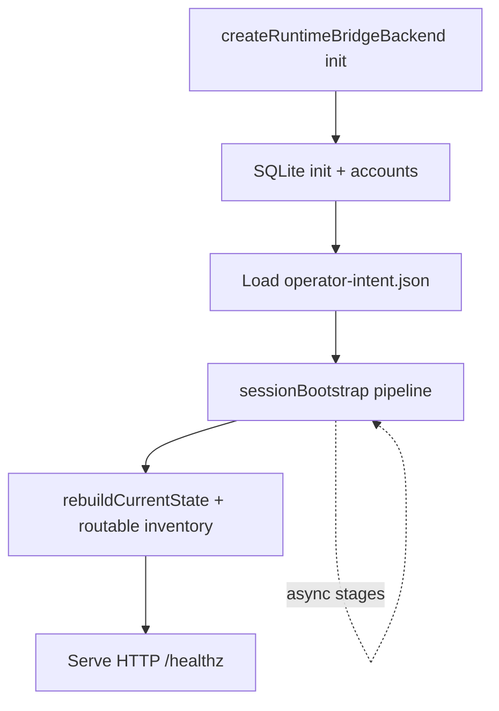

Run: `/.recursive/run/39-runtime-session-rehydration-model-inventory/`
Phase: `02 TO-BE Plan`
Status: `LOCKED`
LockedAt: `2026-06-11T04:48:42Z`
LockHash: `e6fb9084d92c73af77952878d4f1c5e4e229c1e83d35333a4099dda36981d2f0`
Workflow version: `recursive-mode-audit-v2`
Inputs:
- `/.recursive/run/39-runtime-session-rehydration-model-inventory/00-requirements.md`
- `/.recursive/run/39-runtime-session-rehydration-model-inventory/01-as-is.md`
- `/.recursive/run/39-runtime-session-rehydration-model-inventory/00-worktree.md`
Outputs:
- `/.recursive/run/39-runtime-session-rehydration-model-inventory/02-to-be-plan.md`
Scope note: Planned product and worktree changes for session rehydration, bootstrap, inventory-driven aliases, and session readiness surfaces.

## TODO

- [x] Resolve Phase 1 known unknowns (manifest seam, healthz blocking, alias filters)
- [x] Plan implementation sub-phases mapped to `R0`–`R9`
- [x] Plan file-level changes and testing strategy
- [x] Plan verification (strict TDD + restart drill + run 38 regression)
- [x] Complete Coverage Gate checklist
- [x] Complete Approval Gate checklist

## Phase 1 Decisions (resolved)

| Unknown | Decision |
| --- | --- |
| Manifest seam | **Dual-write:** SQLite `runtime_endpoints` remains authoritative for manual remote activations; add versioned `operator-intent.json` at `{runtimeStateRoot}/{scopeId}/operator-intent.json` for peer/llama-swap loads + manifest backup of remote activations |
| `/healthz` blocking | **Non-blocking bootstrap:** pipeline runs async after init; `/healthz` reports `ready` \| `degraded` \| `blocked` from latest bootstrap receipt; HTTP server starts immediately |
| Alias filters (no `model_ids`) | Default pool = all **routable inventory** endpoints matching alias `mode` source filter: `basic` → all inventory; `difficulty` → inventory filtered by per-endpoint `maxDifficulty` + difficulty classifier unchanged; explicit YAML `model_ids` treated as **hints** merged with inventory (union), with drift warnings for hints ∉ inventory |

## Architecture Overview



### Bootstrap stage order (`R3`)

| Stage | Id | Actions |
| --- | --- | --- |
| 1 | `credentials` | `hydrateOauthProviderAccounts`, env hydrate, OAuth path resolution, proactive refresh, resume pending device-auth poll (server-side) |
| 2 | `endpoints` | Load SQLite `runtime_endpoints` (no wipe); reconcile from manifest if SQLite empty |
| 3 | `peers` | For manifest peer entries with `autoReload`, re-probe and invoke peer load handler |
| 4 | `vendors` | Start llama-swap + LiteLLM when configured |
| 5 | `local-reload` | Llama-swap load from manifest when operational |
| 6 | `remote-health` | Probe unified + manual remote endpoints (`R5`) |
| 7 | `inventory` | Build routable inventory; emit alias drift warnings (`R7`) |

Each stage writes a `BootstrapStageReceipt` into in-memory state + optional SQLite diagnostics row + runtime summary API.

### `operator-intent.json` schema v1 (`R2`)

Path: `{runtimeStateRoot}/{scopeId}/operator-intent.json`

```json
{
  "schemaVersion": 1,
  "updatedAt": "ISO-8601",
  "remoteActivations": [
    {
      "providerAccountId": "moonshot.personal.kimi-code",
      "modelId": "moonshot/kimi-k2.6",
      "region": "global",
      "endpointId": "moonshot.personal.kimi-code.global.kimi-k2.6",
      "modelRoleBindings": [{ "modelId": "moonshot/kimi-k2.6", "roleIds": ["general.chat"] }]
    }
  ],
  "peerLoads": [
    {
      "peerId": "default",
      "modelId": "lfm2.5-8b-a1b",
      "roleIds": ["general.chat", "tool.agent"],
      "autoReload": true
    }
  ],
  "llamaSwapLoads": [
    {
      "modelId": "your-model-id",
      "roleIds": [],
      "autoReload": true
    }
  ]
}
```

**Conflict resolution (startup):** SQLite `runtime_endpoints` wins for remote activations when both exist; manifest fills gaps when SQLite row missing. Peer/llama-swap loads: manifest is authoritative (SQLite does not store these today).

**Write hooks:** `upsertRuntimeEndpoint`, peer load, llama-swap load, endpoint deactivate — each updates manifest atomically (write temp + rename).

### OAuth path unification (`R4`)

New helper `resolveOauthCredentialRef(providerId, providerAccountId, accountKind)`:

1. Prefer existing account `credentialRef` if file exists
2. Else try `credentials/oauth/{providerId}/{providerAccountId}.json`
3. Else try `credentials/oauth/{providerId}/{providerId}.litellm.json` (unified)
4. `createUnifiedProviderAccounts` uses same resolver

Pending device-auth: bootstrap stage 1 schedules `pollProviderDeviceAuthorization` for unexpired pending sessions (bounded attempts; records `failed`/`expired` in bootstrap receipt).

### Routable inventory + aliases (`R7`)

New `routable-inventory.ts`:

- `buildRoutableInventory(registry, bootstrapHealth)` → `{ modelIds, endpointIds, bySourceType }`
- `resolveAliasAllowEndpoints(alias, inventory, registry)` replaces direct `collectAllowedEndpointIds(registry, alias.modelIds)` when inventory mode enabled (default on)
- Drift: `warnAliasModelIdDrift(alias, inventory)` at bootstrap + config save
- Empty pool: throw/route diagnostic `ALIAS_POOL_EMPTY` with alias id in `routingDiagnostics` and summary

Config save (`applyUnifiedRuntimeConfig`): validate each alias resolves to ≥1 inventory endpoint **or** defers validation with warning when bootstrap not yet run (documented in API error).

### Session readiness (`R8`)

- Extend runtime summary payload with `sessionBootstrap: { status, stages[], aliasDrift[], inventorySummary }`
- Runtime UI: add **Control > Session readiness** route (`/app/control/session-readiness`) reading summary API; dashboard shows compact bootstrap status pill linking to detail
- No changes to run 38 split Local pages except optional non-blocking banner when bootstrap `degraded`

### Endpoint wipe removal (`R1`)

- Delete `clearRuntimeEndpoints()` call from init
- Keep function for explicit operator reset: `POST /api/role-model/runtime/reset-endpoints` (documented, requires bearer) — clears SQLite endpoints **and** prunes manifest `remoteActivations`

## Implementation Sub-phases

### SP1 — Operator intent manifest + endpoint persistence (`R1`, `R2`)

- Add `operator-intent.ts` + tests (schema validate, atomic write, merge rules)
- Remove init-time `clearRuntimeEndpoints()` call
- Wire manifest updates to activate/deactivate, peer load, llama-swap load
- RED: restart rehydrate test — activate endpoint → recreate backend → endpoint still listed

### SP2 — Session bootstrap pipeline (`R3`, `R4`, `R6`)

- Add `session-bootstrap.ts` + tests (stage ordering, partial failure isolation, pending OAuth resume mock)
- Integrate into `createRuntimeBridgeBackend` after SQLite init (async, non-blocking)
- Peer/llama-swap reload via existing split load handlers (no duplicate logic)
- OAuth credential resolver + proactive refresh hook
- Extend `/healthz` vendor payload with bootstrap aggregate status

### SP3 — Remote health probes (`R5`)

- Add `remote-health-probe.ts` + injected fetcher tests
- Run as bootstrap stage 6 after vendors up
- Update endpoint `healthStatus` in registry sources / runtime state diagnostics

### SP4 — Routable inventory + alias reconciliation (`R7`)

- Add `routable-inventory.ts` + tests (inventory build, hint merge, empty pool diagnostic)
- Replace alias pool resolution in `resolveRequestedModelPool`
- Config save validation for alias resolution
- Bootstrap drift warnings in stage 7

### SP5 — Session readiness surfaces (`R8`)

- Extend summary API types + bridge handler
- Add `session-readiness.tsx` route + dashboard pill
- `runtime-api.ts` fetchers + minimal view-model tests

### SP6 — Validation floor + restart drill (`R0`, `R9`, `R11`)

- Extend `index.test.ts` restart scenarios (OAuth + endpoints + inventory)
- Add `scripts/validate-session-rehydration.ts` or extend `start-for-qa.ts` helper
- Phase 5: SEA rebuild, restart drill, `probe-downstream-ingress.py`, run 38 regression

## Worktree scope (planned)

- `role-model-router/apps/runtime-host-bridge/src/operator-intent.ts` (new)
- `role-model-router/apps/runtime-host-bridge/src/session-bootstrap.ts` (new)
- `role-model-router/apps/runtime-host-bridge/src/routable-inventory.ts` (new)
- `role-model-router/apps/runtime-host-bridge/src/remote-health-probe.ts` (new)
- `role-model-router/apps/runtime-host-bridge/src/index.ts` (bootstrap wiring, remove wipe, summary API)
- `role-model-router/apps/runtime-host-bridge/src/unified-runtime-config.ts` (alias save validation)
- `role-model-router/packages/sqlite-memory/src/index.ts` (optional bootstrap diagnostics table — only if needed; prefer in-memory + summary first)
- `role-model-router/apps/runtime-ui/app/routes/session-readiness.tsx` (new)
- `role-model-router/apps/runtime-ui/app/routes/dashboard.tsx` (bootstrap pill)
- `role-model-router/apps/runtime-ui/app/lib/runtime-api.ts`
- `role-model-router/apps/runtime-ui/app/lib/design-system.ts` (nav entry)

## Planned Changes by File

| File | Change |
| --- | --- |
| `operator-intent.ts` | Schema v1, read/write/validate, merge helpers |
| `session-bootstrap.ts` | Stage orchestration, receipts, async runner |
| `routable-inventory.ts` | Inventory snapshot, alias resolution, drift warnings |
| `remote-health-probe.ts` | Probe remote endpoints with reason codes |
| `index.ts` | Remove init wipe; bootstrap invoke; OAuth resolver; summary extension; reset-endpoints route |
| `unified-runtime-config.ts` | Alias inventory validation on save |
| `session-readiness.tsx` | Control surface for bootstrap/readiness |
| `dashboard.tsx` | Compact bootstrap status |
| `runtime-api.ts` | Summary/bootstrap types |
| `design-system.ts` | `Control > Session readiness` nav |

## Implementation Steps

1. **SP1** — RED tests for manifest + endpoint rehydrate; GREEN implementation; lock evidence
2. **SP2** — RED bootstrap stage tests; GREEN pipeline + OAuth resume; integrate async
3. **SP3** — RED health probe tests; GREEN probe stage
4. **SP4** — RED inventory/alias tests; GREEN resolution + drift + config validation
5. **SP5** — UI session readiness route + API wiring
6. **SP6** — Full test suite, SEA rebuild, restart drill artifact

`TDD Mode` for Phase 3: **strict** (RED before each production file touch in SP1–SP4).

## Testing Strategy

| Layer | Command | Gate |
| --- | --- | --- |
| Unit | `vitest run apps/runtime-host-bridge/src/operator-intent.test.ts` | SP1 |
| Unit | `vitest run apps/runtime-host-bridge/src/session-bootstrap.test.ts` | SP2 |
| Unit | `vitest run apps/runtime-host-bridge/src/routable-inventory.test.ts` | SP4 |
| Unit | `vitest run apps/runtime-host-bridge/src/remote-health-probe.test.ts` | SP3 |
| Bridge integration | `vitest run apps/runtime-host-bridge/test/index.test.ts` (restart scenarios) | SP6 |
| Regression | run 38 `local-model-role-bindings` + `llama-swap-setup` tests remain green | each SP |
| Packaged | restart drill log `evidence/logs/green/restart-rehydration-*.log` | Phase 5 |
| Ingress | `probe-downstream-ingress.py` 0 BRIDGE_CRASH post-restart | Phase 5 |

All CI tests use injected `networkFetcher`; no live provider calls.

## Playwright Plan (if applicable)

- Not used; agent-operated HTTP QA for restart drill and optional hybrid UI check on `/app/control/session-readiness`.

## Manual QA Scenarios

1. Establish run 38 parity on `:3456` (peer + remote + alias)
2. Stop runtime; relaunch without Providers UI
3. Assert `GET /v1/models` lists `lfm2.5-8b-a1b`, `moonshot/kimi-k2.6`, `mixed.local-remote`
4. Assert runtime summary shows bootstrap `ready` or `degraded` with stage receipts
5. `POST /v1/chat/completions` with `mixed.local-remote` — local endpoint can be selected
6. Open Session readiness page — stages, health, drift visible
7. Run 38 routing regression + probe script on same session

## Idempotence and Recovery

- Manifest writes are atomic (temp file + rename); corrupt manifest → bootstrap `degraded` with parse error in summary (fail closed, no silent skip)
- Bootstrap stages are idempotent per session start
- `POST .../runtime/reset-endpoints` is explicit destructive recovery (operator-only)
- On restart drill failure: fix → rebuild SEA → relaunch → retest (`R9` loop)
- Partial peer reload failure leaves remote models routable (`R3` isolation)

## Out of scope (unchanged)

- Per `00-requirements.md` `OOS1`–`OOS8`; run 38 Local UI split and llama-swap scaffold unchanged.

## Traceability

| Sub-phase | Requirements |
| --- | --- |
| SP1 | `R1`, `R2` |
| SP2 | `R3`, `R4`, `R6` |
| SP3 | `R5` |
| SP4 | `R7` |
| SP5 | `R8` |
| SP6 | `R0`, `R9`, `R11` |
| — | `R10`, `R12`, `R16` preserved by `R0`; no SP work |

Explicit requirement notes:

- `R0` — regression guards in SP6; no run 38 API/UI regressions
- `R1` — remove init wipe; SP1
- `R2` — operator-intent.json; SP1
- `R3` — session-bootstrap.ts; SP2
- `R4` — OAuth resolver + server poll; SP2
- `R5` — remote-health-probe.ts; SP3
- `R6` — peer/llama-swap reload in SP2 stage 3/5
- `R7` — routable-inventory.ts; SP4
- `R8` — session-readiness UI; SP5
- `R9` — tests + validators; SP6
- `R10` — unchanged (OOS1)
- `R11` — SP6 regression floor
- `R12` — unchanged (OOS1)
- `R16` — worktree isolation continues

## Subagent Capability Probe

- Subagent tools available; Phase 2 plan authored by controller.
- Delegation Decision Basis: AS-IS and requirements fully loaded; self-audit sufficient for planning.

## Audit Execution Mode

- self-audit

## Coverage Gate

- [x] Every in-scope `R0`–`R9` maps to at least one sub-phase
- [x] Phase 1 unknowns resolved with concrete decisions
- [x] Manifest schema, bootstrap order, and alias policy documented
- [x] Verification includes restart drill and run 38 regression

Coverage: PASS

## Approval Gate

- [x] Plan is implementable within worktree scope
- [x] Minimizes new stores (one JSON manifest + existing SQLite)
- [x] Run 38 surfaces preserved per `R0` and `OOS1`

Approval: PASS

Audit: PASS
