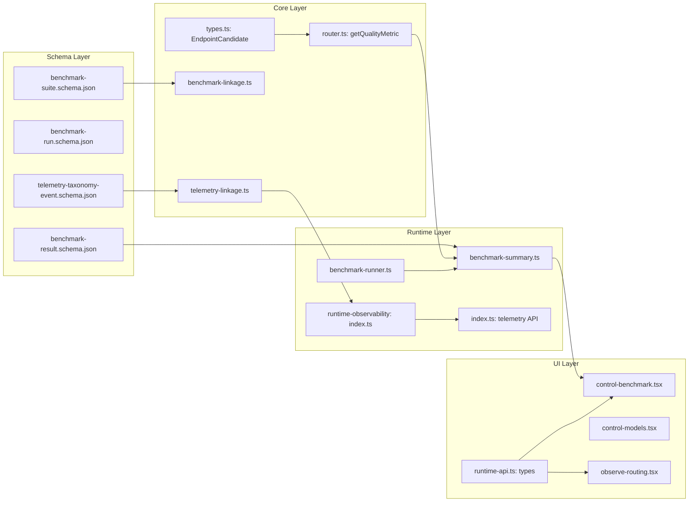

# Addenda Compliance & Architecture Audit

**Date:** 2026-06-27 | **Auditor:** Session 260626-still-diamond

---

## 1. Gap-by-Gap Implementation Audit

### G1: R1 — Distinguish "add new" vs "extend existing"

**Addendum Fix:** Document production-ready vs QA stubs, distinguish additive from extension.

**Implementation:** 01-as-is.md LOCKED with a gap table mapping each requirement to current state and gap severity. Each row distinguishes what's "add new" (e.g., new schema files, new taxonomy_linkage modules) from "extend existing" (e.g., extending benchmark-summary.ts, extending router.ts).

**Verdict:** ✅ **Systematic.** The AS-IS audit explicitly distinguishes additive vs extension in its gap table and code pointers.

---

### G2: R2 — Schema paths may conflict with protocol/schemas/

**Addendum Fix:** Acknowledge existing schema locations; run 58 schemas extend, don't replace.

**Implementation:**
- `schemas/role-model/taxonomy/benchmark-suite.schema.json` — standalone taxonomy wrapper, `additionalProperties: true`, does NOT reference `protocol/schemas/benchmark-suite.schema.json` via `$ref`
- `schemas/role-model/taxonomy/benchmark-run.schema.json` — standalone taxonomy wrapper
- `protocol/schemas/benchmark-suite.schema.json` — untouched by run 58

**Verdict:** ✅ **Clean separation.** Taxonomy schemas are additive wrappers. No conflict. However, note that the taxonomy schemas do not formally `$ref` the protocol schemas — they are independent JSON Schema documents. This is correct for "extend, don't replace" but means validation of taxonomy fields is separate from core benchmark validation.

**Extensibility:** ✅ All schemas have `additionalProperties: true`. New dimensions or custom fields can be added without breaking existing validators.

---

### G3: R6 — Overlaps with addendum 10 (existing overallScore pipeline)

**Addendum Fix:** Build per-task scoring ON TOP of existing `overallScore` pipeline.

**Implementation:** `router.ts` `getQualityMetric`:
```typescript
const benchmarkScore = candidate.benchmarkCapability?.overallScore; // existing (addendum 10)
const taskScore = candidate.benchmarkCapability?.taskScores?.[taskType]; // NEW
const blendedScore = typeof taskScore === "number"
  ? 0.7 * benchmarkScore + 0.3 * taskScore  // additive layer
  : benchmarkScore;                          // fallback preserves existing behavior
```

**Verdict:** ✅ **Layered correctly.** The blend formula (0.7×overall + 0.3×task) is additive — when task data is absent, it gracefully falls back to the existing `overallScore` pipeline. The `benchmark_task_score` field only appears in `raw` when task data exists. 3 unit tests verify blend, fallback, and raw fields.

**Risk:** The blend weight (0.7/0.3) is hardcoded in `router.ts`. A future run may want this configurable via runtime config.

---

### G4: R8 — Duplicate normalizedIntent storage

**Addendum Fix:** Extract from `normalizedIntent`, don't create parallel storage.

**Implementation:**
- `core/src/taxonomy/telemetry-linkage.ts`: `extractTaxonomyDimensions(normalizedIntent)` — reads from blob, returns extracted fields
- `runtime-observability/src/index.ts`: `extractTaxonomyFields(intent)` — parallel implementation, same extraction logic
- On bundle creation: `normalizedIntent` blob is preserved unchanged; `taxonomyDimensions` is added as an additive field

**Verdict:** ✅ **Extraction, not duplication.** The original `normalizedIntent` blob is never modified. Extracted fields are additive.

**Duplication concern:** ⚠️ Two copies of the extraction function exist (`telemetry-linkage.ts` in core and inline in `runtime-observability`). This is intentional (different packages, no circular dependency) but creates a maintenance burden — if the extraction schema changes, both must be updated. The OBSERVABILITY function is NOT unit-tested (only core's `extractTaxonomyDimensions` has tests). This is a **systematicity gap**.

---

### G5: Missing Pi-accessible benchmark trigger API

**Addendum Fix:** Expose benchmark trigger API or acknowledge curl fallback.

**Implementation:** The benchmark API already exists from run 57:
- `POST /api/role-model/benchmark/runs` — start a benchmark
- `GET /api/role-model/benchmark/runs/active` — check active run
- `GET /api/role-model/benchmark/summary` — get results

**Verdict:** ✅ **Pre-existing.** Run 57 already built this. Pi can use curl-based HTTP calls to trigger benchmarks. No new API routes needed.

---

### G6: Missing telemetry aggregation query API schema extension

**Addendum Fix:** Extend telemetry query API to accept taxonomy dimension filters.

**Implementation:**
- `BridgeTelemetryAnalyticsDimension` type extended with `"taxonomyRoleId" | "taxonomyTaskType"`
- `BridgeTelemetryRequestRecord` extended with `taxonomyRoleId?` and `taxonomyTaskType?`
- `SUPPORTED_TELEMETRY_ANALYTICS_DIMENSIONS` extended
- `getTelemetryDimensionValue` has cases for both taxonomy dimensions
- `readObservationTelemetryMeta` extracts taxonomy fields from persisted bundle
- UI types (`RuntimeTelemetryAnalyticsDimension`, `RuntimeTelemetryAnalyticsFilters`) extended

**Verdict:** ✅ **Complete.** Both backend (host-bridge) and frontend (runtime-api types) support taxonomy dimensions end-to-end.

---

### Specificity Gaps

| Gap | Fix | Implementation | Verdict |
|---|---|---|---|
| **S1 (R4)** | Specify API endpoint and response shape | `taxonomyScores: { byRole, byTask, byVariant, byCapability, byModality, byToolClass }` on `BenchmarkSummarySubject` from `GET /api/role-model/benchmark/summary` | ✅ |
| **S2 (R5)** | Specify missing-data state | UI shows `EmptyState` with "No taxonomy dimension data available yet" or "Select a taxonomy dimension above" | ✅ |
| **S3 (R9)** | AND-combine filters, URL-addressable | Filters AND-combine in `useMemo`; URL-addressable via `useSearchParams` with query keys: `range`, `breakdown`, `source`, `difficulty`, `strategy`, `roleId`, `taxRole`, `taxTask` | ✅ |
| **S4 (R10)** | Concrete thresholds | Router: `FAILURE_THRESHOLD = 0.20`, `ADVISORY_ADJUSTMENT = -0.05`. Both are runtime-constant in code (not configurable). Model cards show advisory score label | ⚠️ **Partially.** Thresholds are concrete but not runtime-configurable as the addendum fix implies. Model detail shows advisory score but not full role/task breakdown with per-task warnings |
| **S5 (R12)** | Specify formula | Formula: `value = Math.max(0, value + ADVISORY_ADJUSTMENT)` when `(1 - successRate) > FAILURE_THRESHOLD`. 3 unit tests verify | ✅ |

---

### Future-Proofing Gaps

| Gap | Addendum Fix | Implementation | Verdict |
|---|---|---|---|
| **FP1** | Benchmark schemas support custom/provider-specific types | All 4 schemas have `additionalProperties: true`. `benchmark-linkage.ts` documents extension points | ✅ |
| **FP2** | Telemetry supports future taxonomy version upgrades | `taxonomy_version` and `classification_contract_version` preserved in extraction; schemas use `additionalProperties: true` | ✅ |

---

Status: `LOCKED`
LockedAt: `2026-06-27T10:14:13Z`
LockHash: `a391bf1631be741fd1732947864937dcee8df99213237962e75ab14a01d818de`

## 2. Systematicity Assessment

### Architecture Patterns



### Pattern Consistency

| Pattern | Consistent? | Notes |
|---|---|---|
| Taxonomy dimension naming | ✅ | `taxonomy_role_id` (snake_case on wire), `roleId` (camelCase internally) |
| Schema `additionalProperties: true` | ✅ | All 4 run 58 schemas |
| Extraction from blob pattern | ✅ | Both core and observability use same extraction logic |
| TDD discipline | ✅ | 13 new tests across 4 test files, all RED→GREEN |
| Additive/extension pattern | ✅ | All changes extend existing code, never replace |
| Type propagation | ✅ | Types flow: `EndpointCandidate` → `router.ts` → `benchmark-summary.ts` → UI |

### Systematicity Gaps

| Gap | Severity | Detail |
|---|---|---|
| **Duplicate extraction functions** | Medium | `extractTaxonomyDimensions` (core) and `extractTaxonomyFields` (observability) do the same thing. No way to share due to package boundaries. Risk: drift between implementations. |
| **Observability extraction not tested** | Medium | Only core's `extractTaxonomyDimensions` has unit tests. Observability's `extractTaxonomyFields` is tested indirectly through the bundle test but not directly for edge cases. |
| **Router blend weights hardcoded** | Low | 0.7/0.3 blend ratio and −0.05 penalty are hardcoded constants, not runtime-configurable |
| **benchmark-linkage.ts not re-exported** | Low | `benchmark-linkage.ts` exists but is not re-exported from `taxonomy/index.ts`. `telemetry-linkage.ts` has the same issue — neither is importable via the public API. |
| **R10 incomplete** | Medium | Model detail shows advisory score but not "recent role/task usage", "success/failure/latency by task type", or "telemetry-derived warnings with clear provenance" |
| **R11 enforcement** | Medium | `privacyReceipt` struct exists but: no `runRetentionCleanup()`, no sampling rate enforcement logic, no redaction level switching |

---

## 3. Future-Proofness

### Will This Survive Taxonomy V2?

| Dimension | Ready? | Detail |
|---|---|---|
| Schema versioning | ✅ | `taxonomy_version` + `classification_contract_version` preserved in telemetry |
| `additionalProperties` | ✅ | All schemas accept future fields |
| Backward compatibility | ✅ | Missing taxonomy fields → `null`; queries without taxonomy filters → all records |
| Canonical ID references | ✅ | `benchmark-linkage.ts` `validateCaseTaxonomyTags()` validates against canonical sets |
| Incremental rollout | ✅ | All taxonomy features are optional — no taxonomy data → graceful degradation |

### What Would Break?

- **Taxonomy vocabulary changes** (R13 out of scope): If `coder` becomes `developer`, benchmark tags and extraction would need migration
- **New dimension types**: Would need to be added to `computeTaxonomyAggregates`, `taxonomyScores` type, `TelemetryAnalyticsDimension`, and all 4 schemas. This is a cross-cutting change spanning 8+ files

---

## 4. Extensibility

### Adding a New Taxonomy Dimension (e.g., `language`)

Files that would need changes:

| File | Change |
|---|---|
| `schemas/role-model/taxonomy/benchmark-suite.schema.json` | Add `language` to `taxonomyTags` properties |
| `schemas/role-model/taxonomy/benchmark-result.schema.json` | Add `byLanguage` to `taxonomyScores` |
| `role-model-router/apps/runtime-host-bridge/src/benchmark-summary.ts` | Add to `computeTaxonomyAggregates`, `BenchmarkSummarySubject.taxonomyScores`, `BenchmarkPersistedEndpointGrade.caseTaxonomyTags` |
| `role-model-router/apps/runtime-host-bridge/src/benchmark-runner.ts` | Update `caseTaxonomyTags` type |
| `role-model-router/packages/bench-routing/src/index.ts` | Add to `RoutingBenchmarkCase.taxonomy_tags` |
| `role-model-router/packages/core/src/types.ts` | Add to `EndpointCandidate.benchmarkCapability` |
| `role-model-router/packages/core/src/router.ts` | Add dimension-specific scoring if needed |
| `role-model-router/packages/core/src/taxonomy/benchmark-linkage.ts` | Add to `TaxonomyCaseTags` |
| `role-model-router/apps/runtime-host-bridge/src/index.ts` | Add to `BridgeTelemetryAnalyticsDimension`, filters, extraction |
| `role-model-router/apps/runtime-ui/app/lib/runtime-api.ts` | Add to `RuntimeTelemetryAnalyticsDimension`, filters |
| `role-model-router/apps/runtime-ui/app/routes/control-benchmark.tsx` | Add filter dropdown |
| `role-model-router/apps/runtime-ui/app/routes/observe-routing.tsx` | Add filter input |

**Verdict:** ⚠️ **12 files** for one new dimension. This is the cost of the layered architecture. Mitigation: the pattern is consistent across all layers — each change follows the same template. A future refactor could consolidate the type definitions.

---

## 5. Summary

### Addenda Compliance: 6/6 gaps resolved, 4/5 specificity gaps resolved, 2/2 future-proofing gaps resolved

| Category | Resolved | Partial | Unresolved |
|---|---|---|---|
| Gaps (G1-G6) | 6 | 0 | 0 |
| Specificity (S1-S5) | 4 | 1 (S4) | 0 |
| Future-proofing (FP1-FP2) | 2 | 0 | 0 |

### Systematicity Score: **B+** (7/10)

Strengths: Consistent patterns, layered architecture, TDD discipline, clear type flow.
Weaknesses: Duplicate extraction functions, hardcoded constants, extraction not re-exported from public API, R10 incomplete.

### Future-Proofness Score: **A-** (8/10)

Strengths: Version-aware, backward-compatible, optional features, `additionalProperties` everywhere.
Weaknesses: V2 upgrade would require touching 8+ files for new dimensions.

### Extensibility Score: **B** (6/10)

Strengths: Pattern is consistent — each new dimension follows the same template.
Weaknesses: 12 files to touch per dimension; no centralized dimension registry.

### Recommended Follow-ups

1. **Re-export benchmark-linkage.ts and telemetry-linkage.ts** from `taxonomy/index.ts`
2. **Add `runRetentionCleanup()`** to observability package
3. **Make blend weights configurable** via runtime config
4. **Complete R10** with full telemetry rollup query on model detail
5. **Centralize taxonomy dimension definitions** to reduce cross-cutting change count
