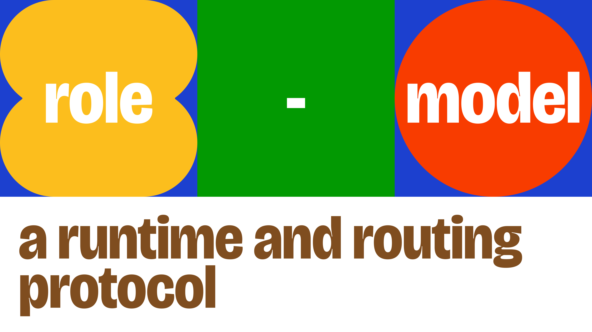

<p align="center"></p>

# role-model

`role-model` is an open protocol for capability-aware AI routing, plus a reference router that implements
that protocol.

It gives a router a durable contract for describing **what a request needs**, **what an endpoint can do**,
**what policy allows**, and **why a final routing decision was made**.


## What role-model does

Every AI workload eventually faces the same question: *which model should handle this request?* The answer
depends on task type, required capabilities, cost, latency, and whether the model is running locally or in
the cloud. `role-model` makes that decision explicit, explainable, and portable.

At a high level, `role-model` separates AI routing into a few stable pieces:

1. **Requests** describe task type, required capabilities, modalities, tool needs, and constraints.
2. **Endpoint identities and profiles** describe concrete routable endpoints rather than abstract model names.
3. **Routing policy** applies hard denies, preferences, budgets, and tie-break rules.
4. **Observability artifacts** record the decision, trace, usage, and observed performance.

The reference router supports **hybrid routing** across three deployment shapes:

- **Local / Local** - route between local models (e.g., llama-swap peers) based on role, task, and capability
- **Local / Cloud** - route between a local model and a cloud provider based on cost, latency, and task difficulty
- **Cloud / Cloud** - route between cloud providers (e.g., OpenAI, DeepSeek, Moonshot) based on capability and economics

This means a single runtime can serve a quick chat request from a fast local model, route a complex coding
task to a capable cloud model, and fall back to a cheaper cloud endpoint when the primary is degraded, all
under one explainable routing contract.

## Install the runtime

For end users, prefer the packaged standalone runtime over a source build.

### macOS and Linux

```bash
curl -fsSL https://raw.githubusercontent.com/try-works/role-model/main/scripts/install.sh | sh
```

The installer downloads the latest GitHub Release archive, installs it under
`~/.local/share/role-model-router/<version>/<target>/`, and exposes a `role-model-router` launcher in
`~/.local/bin`.

### Windows

```powershell
irm https://raw.githubusercontent.com/try-works/role-model/main/scripts/install.ps1 | iex
```

The installer downloads the latest GitHub Release archive, installs it under
`%LOCALAPPDATA%\Programs\RoleModelRouter\<version>\<target>\`, and creates a `role-model-router.cmd`
launcher.

### Manual downloads

If you do not want to use installer scripts, download the matching archive from GitHub Releases.

| Platform | Archive | Launch |
| --- | --- | --- |
| Windows | `role-model-router-win32-x64.zip` | `Role-Model.bat` or `role-model-runtime.exe` |
| macOS x64 | `role-model-router-darwin-x64.tar.gz` | `role-model-runtime` |
| macOS arm64 | `role-model-router-darwin-arm64.tar.gz` | `role-model-runtime` |
| Linux x64 | `role-model-router-linux-x64.tar.gz` | `role-model-runtime` |

## Installation for Pi

The `pi-role-model` package connects Pi to an externally running Role-Model runtime.

Start the Role-Model runtime first, then install the public Pi package:

```bash
pi install npm:@try-works/pi-role-model
```

For local checkout testing from this repository, install the package directly:

```bash
pi install ./packages/pi-role-model
```

Inside Pi, run:

```text
/role-model setup
/role-model doctor
/role-model alias list
/role-model alias choose
/role-model alias use <alias>
/role-model requests
/role-model explain latest
```

By default the package connects to `http://127.0.0.1:3456` and registers Role-Model as the
`role-model` provider using `/api/role-model/downstream/openai`. Set `ROLE_MODEL_ENDPOINT`
before starting Pi to use a different local runtime. Remote endpoints require explicit
trusted `allowRemote` behavior, and runtimes that report `authentication.required` fail
closed unless a future supported token source is configured. For local development installs
and the full command reference, see
[`packages/pi-role-model/README.md`](packages/pi-role-model/README.md).

## Develop from source

### Prerequisites

- **Node.js 24** (required for `node:sqlite` and SEA support)
- **pnpm 10.x** (via `corepack enable`)
- **Go 1.24+** (for llama-swap vendor binary and Windows launcher)

```bash
corepack enable
corepack pnpm install
```

### Smoke test

```bash
corepack pnpm run smoke
```

For a fuller walkthrough, see [`docs/public/quickstart.md`](docs/public/quickstart.md).

### Development build

Run the bridge and UI in development mode (separate processes):

```bash
# Terminal 1: bridge server
cd role-model-router/apps/runtime-host-bridge
corepack pnpm exec tsx scripts/start-for-qa.ts

# Terminal 2: UI dev server
cd role-model-router/apps/runtime-ui
corepack pnpm exec react-router dev --port 5173 --host 127.0.0.1
```

Then open `http://127.0.0.1:5173` in your browser.

### Production build (all platforms)

Build the UI and package the SEA runtime:

```bash
# Build UI static files
corepack pnpm --filter @role-model-router/runtime-ui run build

# Package the bridge as a single executable
corepack pnpm run runtime:package-sea
```

Output: `role-model-router/dist/release/<platform-arch>/role-model-runtime`

### Windows desktop launcher

Build a complete Windows package with dedicated browser window:

```bash
# 1. Build UI
corepack pnpm --filter @role-model-router/runtime-ui run build

# 2. Package bridge SEA runtime
corepack pnpm run runtime:package-sea

# 3. Build Go launcher
cd role-model-router/apps/launcher
go build -o ../../dist/release/win32-x64/role-model-launcher.exe main.go

# 4. Bundle UI files
cp -r ../runtime-ui/build/client ../../dist/release/win32-x64/
```

Then double-click `role-model-launcher.exe` in `dist/release/win32-x64/`. It will:
- Start the bridge server on port 3456
- Open Microsoft Edge in app mode (dedicated window)
- Serve the UI directly from the bridge (no separate dev server)

## Documentation

| Read this | If you want |
| --- | --- |
| [`docs/public/README.md`](docs/public/README.md) | the docs hub |
| [`docs/public/introduction.md`](docs/public/introduction.md) | what role-model is and why it exists |
| [`docs/public/quickstart.md`](docs/public/quickstart.md) | a real end-to-end smoke run |
| [`docs/public/concepts/how-role-model-works.md`](docs/public/concepts/how-role-model-works.md) | the system flow |
| [`docs/public/concepts/protocol-overview.md`](docs/public/concepts/protocol-overview.md) | the protocol surface |
| [`docs/public/concepts/routing-overview.md`](docs/public/concepts/routing-overview.md) | how routing decisions happen |
| [`protocol/README.md`](protocol/README.md) | canonical schemas and fixtures |
| [`role-model-router/README.md`](role-model-router/README.md) | reference router packages and runtime apps |
| [`docs/protocol/routing-policy.md`](docs/protocol/routing-policy.md) | routing policy reference |
| [`docs/protocol/taxonomy-v1.md`](docs/protocol/taxonomy-v1.md) | taxonomy V1 groups, roles, tasks, and Pi classification |
| [`docs/protocol/roles.md`](docs/protocol/roles.md) | role metadata reference |
| [`docs/protocol/tasks.md`](docs/protocol/tasks.md) | task metadata reference |
| [`docs/operations/02-ci-and-release-flow.md`](docs/operations/02-ci-and-release-flow.md) | CI, release automation, and workflow ownership |
| [`CHANGELOG.md`](CHANGELOG.md) | release history |

## Acknowledgements

`role-model` builds on the work of several open-source projects:

- [**llama-swap**](https://github.com/mostlygeek/llama-swap) - the vendored local model lifecycle manager that handles process supervision, request forwarding, and model swapping for local endpoints
- [**LiteLLM**](https://github.com/BerriAI/litellm) - the unified LLM API abstraction whose provider catalog, model metadata, and pricing data inform the routing-compatible provider inventory

## License

This repository is licensed under `BUSL-1.1` with a project-specific
Additional Use Grant. Internal production use, evaluation, development,
modification, and non-production redistribution are permitted under the root
license. Hosted or managed third-party services, paid product embedding, and
third-party commercialization require a separate commercial license.

See [LICENSE](LICENSE) for the full terms. Contributions require acceptance of
the [Contributor License Agreement](CLA.md) before they can be merged.

Only individual contributions are accepted. Please do not submit work owned by
an employer, client, company, or other entity unless you personally have the
right to contribute it under this project's terms.
