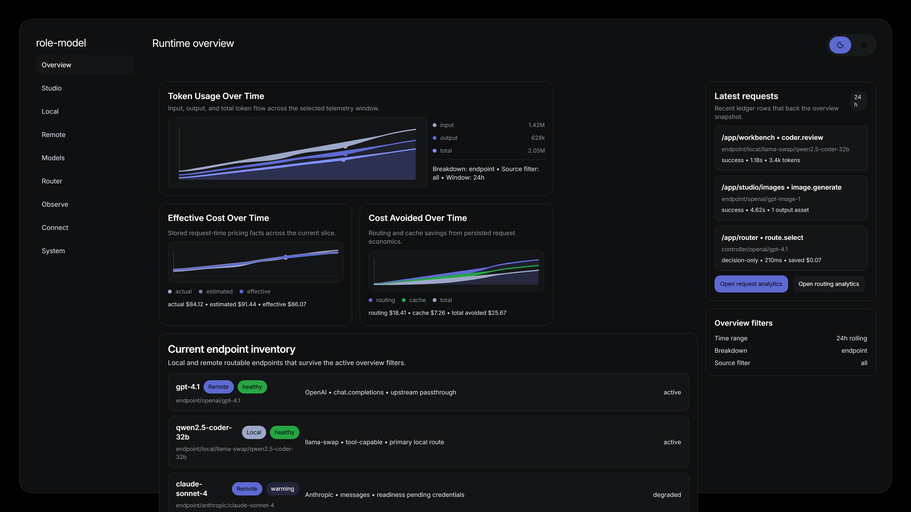

# role-model

`role-model` is an open protocol for capability-aware AI routing, plus a reference router that implements
that protocol.

It gives a router a durable contract for describing **what a request needs**, **what an endpoint can do**,
**what policy allows**, and **why a final routing decision was made**.



## Why role-model

Every AI workload eventually faces the same question: *which model should handle this request?* The answer
depends on task type, required capabilities, cost, latency, and whether the model is running locally or in
the cloud. `role-model` makes that decision explicit, explainable, and portable.

The reference router supports **hybrid routing** across three deployment shapes:

- **Local / Local** - route between local models (e.g., llama-swap peers) based on role, task, and capability
- **Local / Cloud** - route between a local model and a cloud provider based on cost, latency, and task difficulty
- **Cloud / Cloud** - route between cloud providers (e.g., OpenAI, DeepSeek, Moonshot) based on capability and economics

This means a single runtime can serve a quick chat request from a fast local model, route a complex coding
task to a capable cloud model, and fall back to a cheaper cloud endpoint when the primary is degraded, all
under one explainable routing contract.

## Start here

The public-facing docs live under [`docs/public/`](docs/public/README.md). That folder is intentionally
separate so a future docs site can serve directly from it without mixing onboarding content with lower-level
reference docs.

| Read this | If you want |
| --- | --- |
| [`docs/public/README.md`](docs/public/README.md) | the docs hub |
| [`docs/public/introduction.md`](docs/public/introduction.md) | what role-model is and why it exists |
| [`docs/public/quickstart.md`](docs/public/quickstart.md) | a real end-to-end smoke run |
| [`docs/public/concepts/how-role-model-works.md`](docs/public/concepts/how-role-model-works.md) | the system flow |
| [`docs/public/concepts/protocol-overview.md`](docs/public/concepts/protocol-overview.md) | the protocol surface |
| [`docs/public/concepts/routing-overview.md`](docs/public/concepts/routing-overview.md) | how routing decisions happen |

## What role-model is

At a high level, `role-model` separates AI routing into a few stable pieces:

1. **Requests** describe task type, required capabilities, modalities, tool needs, and constraints.
2. **Endpoint identities and profiles** describe concrete routable endpoints rather than abstract model names.
3. **Routing policy** applies hard denies, preferences, budgets, and tie-break rules.
4. **Observability artifacts** record the decision, trace, usage, and observed performance.

That makes routing explainable and portable across different providers, hosts, and deployment shapes.

## What role-model is not

`role-model` is not:

- a single provider SDK
- a prompt-role library that permanently binds one persona to one model
- a monolithic runtime host
- a benchmark-only project with no routing contract

The protocol is the canonical contract. The router in `role-model-router/` is the reference implementation
of that contract.

## What you get in this repository

- canonical schemas and fixtures under [`protocol/`](protocol/README.md)
- protocol and architecture reference docs under [`docs/`](docs)
- shared tooling and generated types under `packages/`
- a deterministic reference router under [`role-model-router/`](role-model-router/README.md)
- a smoke flow that emits real routing artifacts under `runtime-output/gateway-smoke/`

## Current baseline

Today this repository is a **real baseline**, not only a design sketch:

- the protocol and schemas are implemented
- the router core and conformance coverage are implemented
- the smoke path and emitted artifacts are implemented
- some future host/runtime families are still architecture-stage rather than production-ready

## Install

For end users, prefer the packaged standalone runtime over a source build.

### macOS and Linux

```bash
curl -fsSL https://raw.githubusercontent.com/try-works/role-model/main/scripts/install.sh | sh
```

The installer downloads the latest GitHub Release archive, installs it under
`~/.local/share/role-model-router/<version>/<target>/`, and exposes a `role-model-router` launcher in
`~/.local/bin`.

### Windows

```powershell
irm https://raw.githubusercontent.com/try-works/role-model/main/scripts/install.ps1 | iex
```

The installer downloads the latest GitHub Release archive, installs it under
`%LOCALAPPDATA%\Programs\RoleModelRouter\<version>\<target>\`, and creates a `role-model-router.cmd`
launcher.

### Manual downloads

If you do not want to use installer scripts, download the matching archive from GitHub Releases:

- `role-model-router-linux-x64.tar.gz`
- `role-model-router-darwin-x64.tar.gz`
- `role-model-router-darwin-arm64.tar.gz`
- `role-model-router-win32-x64.zip`

After extracting:

- Windows: run `Role-Model.bat` or `role-model-runtime.exe`
- macOS/Linux: run `role-model-runtime`

## Installation for Pi

The `pi-role-model` package connects Pi to an externally running Role-Model runtime.

Install the public package:

```bash
pi install @try-works/pi-role-model
```

For local development from this repository root:

```bash
pi install ./packages/pi-role-model
```

By default it connects to `http://127.0.0.1:3456`. To use another local runtime endpoint, launch Pi with:

```bash
ROLE_MODEL_ENDPOINT=http://127.0.0.1:4567 pi
```

Remote endpoints are blocked by default. Only enable remote access for a trusted runtime and trusted project context with explicit `allowRemote` behavior, for example `ROLE_MODEL_ALLOW_REMOTE=1`. If Role-Model discovery reports `authentication.required`, the package fails closed unless a future explicit supported token source is configured; it does not read, print, copy, or sync Pi auth files.

Use the package commands inside Pi:

```text
/role-model setup
/role-model status
/role-model doctor
/role-model ui
/role-model alias list
/role-model alias recommended
/role-model alias use <alias>
/role-model alias choose <alias>
/role-model alias refresh
```

`/role-model alias use <alias>` stores the selected alias and asks Pi to make the corresponding Role-Model model active when Pi exposes active model selection. `/role-model ui` only reports the runtime URL; it does not launch or manage the runtime.

This package does not install, start, stop, or update Role-Model. It registers Role-Model as the `role-model` provider using the runtime discovery endpoint at `/api/role-model/downstream/openai`. Start the external runtime separately, then run `/role-model setup`.

The public npm package name is `@try-works/pi-role-model`. The repository-local package install is intended for development and QA.

## Building from source

### Prerequisites

- **Node.js 24** (required for `node:sqlite` and SEA support)
- **pnpm 10.x** (via `corepack enable`)
- **Go 1.24+** (for llama-swap vendor binary and Windows launcher)

```bash
corepack enable
corepack pnpm install
```

### Development build

Run the bridge and UI in development mode (separate processes):

```bash
# Terminal 1: bridge server
cd role-model-router/apps/runtime-host-bridge
corepack pnpm exec tsx scripts/start-for-qa.ts

# Terminal 2: UI dev server
cd role-model-router/apps/runtime-ui
corepack pnpm exec react-router dev --port 5173 --host 127.0.0.1
```

Then open `http://127.0.0.1:5173` in your browser.

### Production build (all platforms)

Build the UI and package the SEA runtime:

```bash
# Build UI static files
corepack pnpm --filter @role-model-router/runtime-ui run build

# Package the bridge as a single executable
corepack pnpm run runtime:package-sea
```

Output: `role-model-router/dist/release/<platform-arch>/role-model-runtime`

### Windows desktop launcher

Build a complete Windows package with dedicated browser window:

```bash
# 1. Build UI
corepack pnpm --filter @role-model-router/runtime-ui run build

# 2. Package bridge SEA runtime
corepack pnpm run runtime:package-sea

# 3. Build Go launcher
cd role-model-router/apps/launcher
go build -o ../../dist/release/win32-x64/role-model-launcher.exe main.go

# 4. Bundle UI files
cp -r ../runtime-ui/build/client ../../dist/release/win32-x64/
```

Then double-click `role-model-launcher.exe` in `dist/release/win32-x64/`. It will:
- Start the bridge server on port 3456
- Open Microsoft Edge in app mode (dedicated window)
- Serve the UI directly from the bridge (no separate dev server)

### Platform-specific notes

| Platform | Launch command | Notes |
| --- | --- | --- |
| Windows | `Role-Model.bat` or `role-model-runtime.exe` | `Role-Model.bat` uses the dedicated launcher when present |
| macOS | `role-model-runtime` | Launching the packaged runtime directly opens the default browser |
| Linux | `role-model-runtime` | Launching the packaged runtime directly opens the default browser |

## Quick start

This repository expects **Node.js 24** and **pnpm 10.x**.

```bash
pnpm install
pnpm run smoke
```

For a fuller walkthrough, see [`docs/public/quickstart.md`](docs/public/quickstart.md).
For GitHub workflow ownership, release automation, and CI diagnostics, see
[`docs/operations/02-ci-and-release-flow.md`](docs/operations/02-ci-and-release-flow.md).
The per-release history and operator checklist live in [`CHANGELOG.md`](CHANGELOG.md) and
[`docs/operations/03-release-checklist.md`](docs/operations/03-release-checklist.md).

## Repository layout

| Path | What it contains |
| --- | --- |
| `docs/public/` | public-facing docs and future docs-site content root |
| `docs/protocol/` | protocol concept/reference docs |
| `docs/architecture/` | architecture and baseline model notes |
| `protocol/` | canonical schemas and example fixtures |
| `packages/` | schema tooling, generated types, and conformance packages |
| `role-model-router/` | reference router packages, adapters, and smoke apps |
| `testdata/` | endpoint metadata, traces, eval inputs, and supporting fixtures |

## Reference docs

- [`protocol/README.md`](protocol/README.md)
- [`docs/protocol/routing-policy.md`](docs/protocol/routing-policy.md)
- [`docs/protocol/roles.md`](docs/protocol/roles.md)
- [`docs/protocol/tasks.md`](docs/protocol/tasks.md)
- [`role-model-router/README.md`](role-model-router/README.md)

## Acknowledgements

`role-model` builds on the work of several open-source projects:

- [**llama-swap**](https://github.com/mostlygeek/llama-swap) - the vendored local model lifecycle manager that handles process supervision, request forwarding, and model swapping for local endpoints
- [**LiteLLM**](https://github.com/BerriAI/litellm) - the unified LLM API abstraction whose provider catalog, model metadata, and pricing data inform the routing-compatible provider inventory

## License

As of 2026-06-16, the current root license for this repository is
`BUSL-1.1` with a project-specific `Additional Use Grant`.

Allowed under the root license:

- internal production use inside your organization
- internal production use inside affiliates under common control
- use of contractors or service providers acting only on your behalf to support that internal use
- evaluation, development, modification, and non-production redistribution

Not allowed under the root license without a separate commercial license from
`try-works`:

- offering `role-model` as a hosted or managed service to third parties
- embedding or bundling `role-model` into a paid product or service for third-party use
- selling or otherwise commercializing `role-model` or a derivative work for third-party use

The full terms are in [LICENSE](LICENSE).

Contributions are governed by [CLA.md](CLA.md), which gives `try-works` broad
relicensing and sublicensing rights for future versions of the project.

Only individual contributions are accepted. If an employer, client, company,
or other entity has rights in a proposed contribution, that contribution must
not be submitted here.

Commits published before 2026-06-16 remain under the license that applied
when they were published, including the earlier `Apache-2.0` history.
