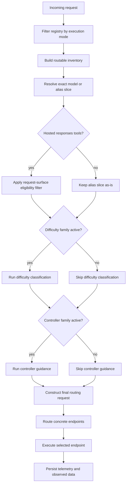
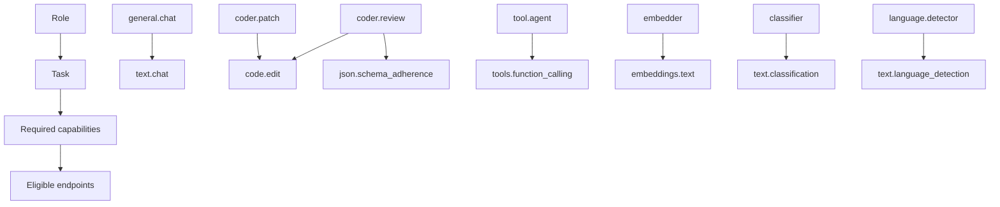
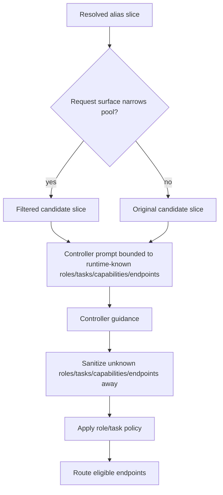

# Runtime Routing Strategy Interactions

This document describes the runtime routing behavior that exists in code today in
`/role-model-router/apps/runtime-host-bridge/`. It complements the earlier lock docs by
describing the actual control-plane, alias, capability, and observed-data interactions
now implemented in the live bridge.

Related durable memory:

- `/.recursive/memory/domains/runtime-routing-and-provider-capabilities.md`

## Main runtime inputs

The live routing path combines six different input families:

1. unified runtime config from `runtime-config.yaml`
2. live endpoint registry plus runtime endpoint state
3. runtime-owned role, task, and role-binding policy
4. catalog and provider metadata
5. observed performance data from SQLite
6. benchmark summaries and benchmark-derived quality signals

No one input is authoritative for everything. The runtime composes them.

## Execution mode defines the endpoint universe first

`executionMode` is the first hard filter applied to the registry.

| Execution mode | Effective endpoint universe |
| --- | --- |
| `remote_only` | only remote API endpoints |
| `local_only` | only local-engine endpoints |
| `decision_only` | all currently known endpoints |
| `hybrid` | all currently known endpoints |

In current code, `decision_only` and `hybrid` use the same registry slice. Their
difference is operator intent and surrounding routing strategy, not a different source
filter.

The bridge applies this in `filterRouterRegistryByExecutionMode()` before alias
resolution, controller guidance, or final `routeRuntimeRequest()` scoring.

## Routing strategy defines the canonical alias family

The runtime normalizes the persisted routing strategy into a canonical alias family:

| Persisted strategy input | Canonical alias family | Alias mode |
| --- | --- | --- |
| `null`, `baseline`, `basic`, `balanced`, `quality`, `cost`, latency-like synonyms | `baseline` or `default` family | `basic` |
| `controller`, `intelligent` | `controller` | `intelligent` |
| `difficulty` | `difficulty` | `difficulty` |
| `hybrid` | `hybrid` | `hybrid` |
| legacy invalid values | `default` fallback | `basic` |

The important distinction is:

1. `executionMode` says which endpoints are even eligible to participate
2. `routingStrategy` says which alias family and request-time behavior to apply within
   that eligible slice

## The runtime now persists a full canonical alias matrix

The bridge no longer materializes only one primary alias for the current strategy and
mode. It now generates a canonical matrix across:

- strategy families:
  - `default`
  - `baseline`
  - `controller`
  - `difficulty`
  - `hybrid`
- execution modes:
  - `decision_only`
  - `hybrid`
  - `local_only`
  - `remote_only`

For a mixed local-plus-remote runtime with available candidates, that currently yields
`20` canonical aliases.

Examples:

- `baseline.remote-only`
- `controller.remote-only`
- `difficulty.local-only`
- `hybrid.hybrid`

Custom non-primary aliases are preserved. Canonical aliases are regenerated from live
state so the operator surface always exposes the full supported matrix instead of a
single special-cased primary alias.

### Canonical alias matrix

The full canonical matrix currently looks like this:

| Strategy family | `decision_only` | `hybrid` | `local_only` | `remote_only` |
| --- | --- | --- | --- | --- |
| `default` | `default.decision-only` | `default.hybrid` | `default.local-only` | `default.remote-only` |
| `baseline` | `baseline.decision-only` | `baseline.hybrid` | `baseline.local-only` | `baseline.remote-only` |
| `controller` | `controller.decision-only` | `controller.hybrid` | `controller.local-only` | `controller.remote-only` |
| `difficulty` | `difficulty.decision-only` | `difficulty.hybrid` | `difficulty.local-only` | `difficulty.remote-only` |
| `hybrid` | `hybrid.decision-only` | `hybrid.hybrid` | `hybrid.local-only` | `hybrid.remote-only` |

Two practical interpretations matter:

1. the left axis determines the behavioral family
2. the top axis determines the endpoint universe that family is allowed to see

### Alias behavior matrix

The canonical aliases are not all interchangeable. Their request-time behavior differs:

| Alias family | Difficulty classifier | Controller guidance | Typical strategy source |
| --- | --- | --- | --- |
| `default.*` | no | no | persisted runtime default / baseline behavior |
| `baseline.*` | no | no | deterministic baseline scoring |
| `controller.*` | no | yes | controller-selected strategy, role, task, and capabilities |
| `difficulty.*` | yes | no | difficulty bucket chooses cost/balanced/quality posture |
| `hybrid.*` | yes | yes | difficulty plan plus controller refinement |

Craft ask-mode heuristics may still participate in request classification, but they are
not a persisted routing strategy and they do not own a canonical alias namespace.

## Canonical alias slices are derived from inventory, then config

When building the matrix, the bridge derives model ids for each execution-mode slice in
this order:

1. execution-mode-filtered routable inventory
2. configured local model ids from `llamaSwap.models`
3. configured remote model ids from `liteLLM.providers`

This matters at startup. If the bridge has not yet rehydrated a fully routable
inventory, the matrix still persists from configured model ids, and later requests can
surface honest `ALIAS_POOL_EMPTY` diagnostics until endpoints become routable.

## Alias resolution is now strict

Alias resolution now works by intersecting `alias.modelIds` with the routable inventory
entries for the current execution slice.

That means:

1. degraded, offline, blocked, or otherwise non-routable endpoints are removed before
   alias pooling
2. aliases do not widen to the whole inventory anymore
3. `allowEndpoints` and `resolvedModelIds` reflect only the exact alias slice
4. empty slices produce `ALIAS_POOL_EMPTY` instead of silently falling back to unrelated
   endpoints

This is the key reason `controller.remote-only` is now an honest remote-only pool rather
than a disguised whole-inventory request.

## Request surface can narrow the pool again

After strict alias resolution, the bridge can still apply request-surface-specific
eligibility filters before difficulty or controller routing runs.

The main current case is `POST /v1/responses` with normalized hosted tools such as:

- `tools: [{ "type": "web_search" }]`

These hosted tools are not treated the same way as ordinary function tools.

In current code:

1. function tools remain broadly routable to endpoints that support normal tool calling
2. normalized hosted `responses` tools are resolved through a transport-aware hosted
   web-search contract matrix
3. if the eligible pool does not share one active native contract on the current runtime
   transport, the bridge classifies those endpoints as `runtime-fallback` rather than
   falsely advertising a shared native hosted-tool contract

### Hosted web-search contract matrix

Hosted web search is transport-specific metadata, not a universal model capability flag.

| Provider slice | Documented provider contract | Active on current runtime transport | Current runtime path |
| --- | --- | --- | --- |
| OpenAI Codex Subscription GPT-5.3+ | `openai.responses.web_search` | yes | native hosted `responses` tool |
| Moonshot / Kimi tool-calling endpoints | `moonshot.chat.builtin_web_search` | yes | native hosted Kimi `builtin_function.$web_search` |
| DeepSeek V4 Anthropic / Claude Code integration | `deepseek.anthropic.server_web_search` | no | `runtime-fallback` on the current OpenAI-compatible transport |
| other function-calling endpoints | none | no | `runtime-fallback` if ordinary tool calling is available |

So the runtime distinguishes three different states:

1. native hosted support on the active transport
2. documented provider-native support on a different transport
3. ordinary tool-calling support that the runtime currently marks as `runtime-fallback`
   instead of a native hosted-tool contract

This is why Kimi and DeepSeek are not excluded from web-search-capable turns just because
they do not share the exact OpenAI Responses hosted-tool contract.

The bridge also exposes this distinction in endpoint inventory metadata through
`webSearchSupport`, which reports:

- `mode`
- `currentRuntimeContract`
- `documentedProviderContract`

This filter also rewrites alias diagnostics, so:

- `aliasResolution.resolvedModelIds`
- `aliasResolution.allowEndpoints`

reflect the post-filter hosted-tool pool rather than the broader pre-filter alias slice.

## Request flow through the bridge

For chat or responses requests, the current bridge flow is:

1. resolve execution mode and filter the registry
2. build routable inventory from the filtered registry and live runtime endpoint health
3. resolve the requested model or alias to an endpoint pool
4. optionally apply request-surface-specific endpoint filtering
5. optionally run difficulty classification
6. optionally run controller guidance for intelligent aliases
7. construct the final routing request
8. call `routeRuntimeRequest()`
9. execute the chosen endpoint through the provider adapter layer
10. persist telemetry and observed-performance facts back to SQLite

Each stage appends diagnostics rather than mutating the user's request invisibly.

## Roles, tasks, and capabilities constrain routing

The runtime controller is no longer free to invent role or task labels. The bridge now
builds the controller prompt from runtime-known values:

- role ids
- task types
- known capabilities
- candidate endpoint ids

The controller output parser then sanitizes the response against those same allowlists.
Unknown roles, tasks, capabilities, strategy values, and endpoint ids are dropped.
Compatible loose values are normalized where possible, for example:

- capability-oriented strategy names map to a supported strategy
- `remote_only` or `remote-only` maps to `preferLocal: false`
- `local_only` or `local-only` maps to `preferLocal: true`

Outside the controller path, the final router still uses:

- endpoint-declared capabilities
- runtime role bindings
- role-to-task policy
- request-required and preferred capabilities

So even if a model is present in an alias pool, it still must satisfy the role and
capability constraints of the request.

### Built-in role and task matrix

The current built-in runtime hierarchy is:

| Role | Supported tasks | Notes |
| --- | --- | --- |
| `general.chat` | `text.chat` | default general assistant path |
| `coder.patch` | `code.edit` | code-edit oriented role |
| `coder.review` | `code.edit`, `json.schema_adherence` | review/refinement and stricter contract work |
| `tool.agent` | `tools.function_calling` | tool-using role, also used today for hosted `responses` tool turns |
| `embedder` | `embeddings.text` | embedding-only path |
| `classifier` | `text.classification` | classification path |
| `language.detector` | `text.language_detection` | language-detection path |

The corresponding task policy layer is:

| Task | Allowed roles | Required capabilities | Preferred capabilities |
| --- | --- | --- | --- |
| `text.chat` | `general.chat` | `text.chat` | none |
| `code.edit` | `coder.patch`, `coder.review` | `code.edit` | `reasoning.multi_step` |
| `json.schema_adherence` | `coder.review` | `json.schema_adherence` | `reasoning.multi_step` |
| `tools.function_calling` | `tool.agent` | `tools.function_calling` | none |
| `embeddings.text` | `embedder` | `embeddings.text` | none |
| `text.classification` | `classifier` | `text.classification` | none |
| `text.language_detection` | `language.detector` | `text.language_detection` | none |

This is intentionally hierarchical:

1. roles are the primary operator-facing unit
2. tasks sit underneath roles
3. capabilities constrain whether a concrete endpoint can satisfy the chosen task

Current live examples:

1. OpenAI Responses hosted web search through `controller.remote-only`
2. exact Kimi hosted search through `builtin_function.$web_search`
3. exact DeepSeek or mixed-provider web-search turns classified as `runtime-fallback`

For the OpenAI exact hosted case:

1. the hosted-tool filter first collapses the pool to the OpenAI endpoint
2. controller guidance then maps the turn into the runtime's existing `tool.agent` /
   `tools.function_calling` policy instead of inventing a new hosted-search-specific role
3. final routing still goes through the normal router, but with a one-endpoint eligible
   pool

For the DeepSeek current-runtime case:

1. the provider docs confirm native web search on the Anthropic / Claude Code surface
2. the current runtime still executes DeepSeek through the OpenAI-compatible transport
3. so the runtime records DeepSeek as `runtime-fallback` rather than falsely advertising
   an OpenAI-surface native hosted contract

## Controller routing now consumes the execution-mode-specific alias slice

For intelligent aliases, the controller candidate pool is built from the resolved alias
slice after execution-mode filtering.

That means:

1. `controller.remote-only` presents only remote candidates to the controller
2. `controller.local-only` presents only local candidates
3. mixed-mode controller aliases can see the broader mixed pool

For hosted `responses` tools, the controller sees the already-filtered hosted-tool
slice, not the broader remote alias slice. So `controller.remote-only` can still behave
like an OpenAI-only pool for one request and a DeepSeek-or-Kimi pool for the next,
depending on the request surface.

The bridge also now gives persisted controller assignments a larger default timeout:

- `DEFAULT_UNIFIED_RUNTIME_CONTROLLER_TIMEOUT_MS = 15000`

That default applies when the runtime is using a persisted controller assignment rather
than an explicitly configured `controller` block in `runtime-config.yaml`.

### Controller decision matrix

At a high level, controller-family aliases now behave like this:

| Request condition | Candidate universe seen by controller | Typical role/task outcome |
| --- | --- | --- |
| `controller.remote-only` ordinary chat | remote alias slice | `general.chat` / `text.chat` |
| `controller.remote-only` harder code/review chat | remote alias slice | `coder.patch` or `coder.review` / `code.edit` |
| `controller.remote-only` OpenAI Responses hosted `web_search` | hosted-tool-filtered OpenAI slice | `tool.agent` / `tools.function_calling` |
| `controller.local-only` request | local alias slice only | depends on local role/task compatibility |
| `controller.hybrid` request | mixed local + remote alias slice | depends on role/task compatibility and scoring |

## Model metadata and endpoint metadata have different jobs

The runtime uses more than one metadata source:

### Catalog and provider metadata

Catalog data supplies durable model and provider facts such as:

- provider ownership
- model identity normalization
- economics and pricing hints
- compatibility hints used by routing and operator surfaces

Provider-specific runtime code can further refine the active surface. The current
OpenAI Codex Subscription implementation exposes only the supported GPT-5.3+ matrix and
marks those rows as supporting:

- function calling
- OpenAI Responses hosted web search

That support matrix is now used in two different ways:

1. to expose the correct operator-facing model inventory
2. to gate hosted `responses` tool routing before the normal difficulty/controller path

### Provider capability matrix

The runtime needs one more distinction that the earlier version of this doc blurred:

1. vendor-documented capability
2. repo-modeled generic capability
3. repo-supported normalized request shape

Current provider examples:

| Provider | Vendor-documented function/tool calling | Vendor-documented web search or official hosted tools | Repo-modeled runtime capability today | Repo-supported normalized hosted-tool contract today |
| --- | --- | --- | --- | --- |
| `OpenAI` | yes | yes | `tools.function_calling` plus Codex Subscription GPT-5.3+ OpenAI Responses hosted-tool support | yes: OpenAI Responses `tools: [{ "type": "web_search" }]` |
| `Kimi` | yes | yes: provider-native official tools such as `web-search`, `rethink`, `code_runner`, `fetch` | cataloged mainly as `tools.function_calling`; K2.6 and K2.7 Code also carry reasoning-related metadata, and the runtime recognizes native Kimi hosted search on the active transport | no generic normalized OpenAI-hosted-tool contract beyond the Kimi-specific path |
| `DeepSeek` | yes | yes in vendor surfaces, including documented native web search in Claude Code integration | cataloged as `tools.function_calling`, with `reasoning` and `structured.output` on newer models; on the current runtime transport it is classified as `runtime-fallback`, not a native hosted-tool contract | no generic normalized hosted-tool contract in this repo today |

So when this doc says a request was narrowed to OpenAI for hosted `web_search`, that
does **not** mean Kimi or DeepSeek cannot search the web. It means only the OpenAI
endpoint currently implements the normalized OpenAI Responses hosted-tool request shape
used by this runtime for that request, while Kimi has its own native path and DeepSeek
is still represented as `runtime-fallback` on the current transport.

### Registry and endpoint metadata

The registry describes concrete live endpoints:

- endpoint id
- serving source
- source type
- declared capabilities
- tool-calling support
- region
- runtime eligibility and current health posture

Routing happens against endpoints, not abstract model families. The catalog helps
describe them; the registry tells the runtime what is actually executable right now.

## Observed data and benchmark data influence routing differently

The runtime keeps these related but distinct:

### Observed data

Observed profiles are loaded from SQLite on each request and are used directly by
`routeRuntimeRequest()` through:

- `observedProfilesByEndpointId`
- `throughputPenaltyStateByEndpointId`
- difficulty-bucket-aware profile selection
- freshness-decayed effective metrics

This is the live feedback loop that influences the route decision itself.

### Benchmark data

Benchmark runs also persist durable artifacts and quality facts. In the current bridge,
benchmark data shows up in two main ways:

1. benchmark-derived profile samples can contribute to the observed-profile story the
   router consumes
2. operator candidate and benchmark surfaces expose benchmark-specific summaries such as
   `benchmarkCapability` and `routingBenchmarkQuality`

So benchmark data is not a separate routing engine. It feeds the same broader evidence
model while also powering operator inspection views.

## Operator surfaces reflect the same composition

The router and observe pages are backed by the same composed state:

- router config shows persisted strategy, execution mode, canonical alias inventory, and
  controller assignment
- router candidates show capabilities, role bindings, execution eligibility, health,
  latest observed profile, and benchmark summaries
- request detail shows alias resolution, controller guidance, observed-profile influence,
  and effective metrics for the chosen route

This is intentional. The operator UI is not meant to infer routing posture from one
table; it reads the same backend-owned control-plane and telemetry outputs used by live
execution.

For hosted-tool requests this means Observe should now show:

- a narrowed alias-resolution pool when hosted `responses` tools are present
- only the supported OpenAI endpoint in `eligibleEndpointIds`
- normal multi-provider candidate pools again on ordinary chat or function-tool requests

For controller-family requests, the most useful inspection matrix is:

| Observe field | What it tells the operator |
| --- | --- |
| `routingDiagnostics.aliasResolution` | the exact alias slice after strict resolution, and after hosted-tool filtering when applicable |
| `routingDiagnostics.controllerRouting` | the sanitized controller directives that were actually accepted |
| `requestedRoleId` / `roleIds` | the role requested vs the roles present on the selected endpoint |
| `eligibleEndpointIds` | the final eligible pool after execution mode, alias, request-surface, role, and capability constraints |
| `selection` / scored candidates | why one endpoint won inside that final pool |

## Current live examples

The patched runtime on `http://127.0.0.1:3462` produced these representative routes:

| Client request id | Request shape | Result |
| --- | --- | --- |
| `live-openai-exact-web-001` | exact `chatgpt/gpt-5.4` `responses` + hosted `web_search` | routed to `openai.personal.openai-codex-subscription.global.gpt-5.4` |
| `live-controller-web-001` | `controller.remote-only` `responses` + hosted `web_search` | alias pool narrowed to OpenAI only, then routed to `openai.personal.openai-codex-subscription.global.gpt-5.4` |
| `live-controller-general-001` | `controller.remote-only` ordinary chat | routed to `deepseek/deepseek-v4-flash` |
| `live-controller-code-001` | `controller.remote-only` harder code/review chat | routed to `moonshot/kimi-k2.7-code` |

These examples matter because they show the intended composition:

1. hosted-tool request surfaces can narrow the pool to OpenAI
2. ordinary controller routing still distributes across DeepSeek and Kimi
3. the hosted-tool fix is intentionally narrow and does not replace the general router

## Practical consequences for future work

Future routing changes should preserve these rules:

1. execution mode filters the endpoint universe before alias or controller logic
2. canonical aliases are a matrix, not a single primary alias
3. alias resolution must stay strict to the alias slice
4. request-surface-specific eligibility filters must run before difficulty/controller
   routing when the transport surface requires them
5. controller guidance must stay bounded to runtime-known roles, tasks, capabilities,
   and candidate endpoints
6. routing should continue to score concrete endpoints using live observed data, while
   benchmark data remains an input to that evidence model rather than a parallel router
